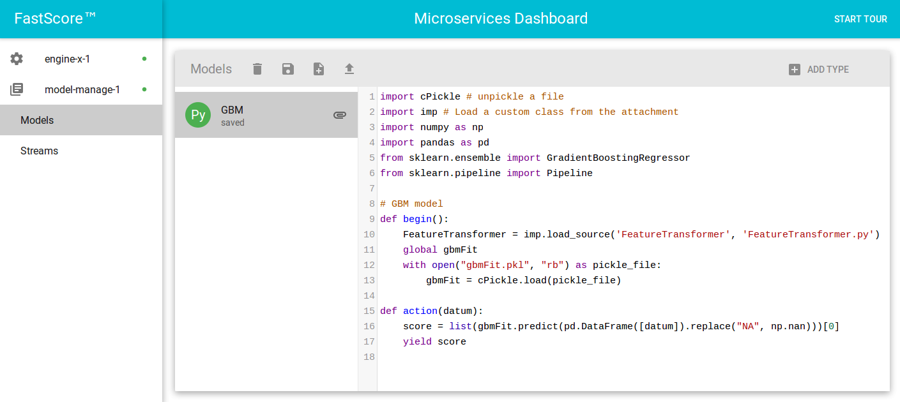

# Gradient Boosting Regressor Example

Gradient Boosting Regressors (GBR) are ensemble decision tree regressor models. In this example, we will show how to prepare a GBR model for use in ModelOp Center. We'll be constructing a model to estimate the insurance risk of various automobiles. The data for this example is freely available from the [UCI Machine Learning Repository](https://archive.ics.uci.edu/ml/datasets/Automobile).

The model will be constructed in Python using [SciKit Learn](http://scikit-learn.org/stable/modules/ensemble.html#gradient-boosting), and both input and output data streams will use Kafka. This example demonstrates several features of ModelOp Center:

1. Running a trained Python model in ModelOp Center
2. Installing additional Python libraries in a ModelOp Center engine
3. Using custom classes with model attachments
4. Scoring records over Kafka streams

All of the files needed to run this example are included [at the bottom of this post](#source-code-for-this-example). To run this locally, you'll need to have installed the following Python libraries:

* NumPy (`numpy`)
* Pandas (`pandas`)
* SciKit Learn (`sklearn`)
* Kafka (`kafka`, if you're using the included Python Kafka client)

Each of these libraries can be installed using `pip`.

## A Brief Review of Gradient Boosting Regressors

Gradient boosting regressors are a type of inductively generated tree ensemble model. At each step, a new tree is trained against the negative gradient of the loss function, which is analogous to (or identical to, in the case of least-squares error) the residual error.

More information on gradient boosting can be found below:

* [Wikipedia](https://en.wikipedia.org/wiki/Gradient_boosting)
* [SciKit Learn Gradient Boosting documentation](http://scikit-learn.org/stable/modules/ensemble.html#gradient-boosting)

## Training and Running a GBR Model in SciKit Learn

This section reviews how to train a GBR model using SciKit Learn in Python.

### The Dataset and the Model

In this example, we're using a GBR model to estimate insurance risk for various types of automobiles from various features of the vehicle. The scores produced are numbers between -3 and +3, where lower scores indicate safer vehicles.

### Transforming Features

To get the best results from our GBR model, we need to do some preprocessing of the input data. To keep the model itself as simple as possible, we will separate the feature preprocessing from the actual scoring, and encapsulate it in its own module:

``` python
from itertools import chain
import numpy as np
import pandas as pd
from sklearn.base import BaseEstimator, TransformerMixin
from sklearn.preprocessing import Imputer, StandardScaler
from sklearn.pipeline import Pipeline

# define transformer to scale numeric variables
# and one-hot encode categorical ones
class FeatureTransformer(BaseEstimator, TransformerMixin):
    def __init__(self, transforms = [("impute", Imputer()), ("scale", StandardScaler())]):
        self.transforms = transforms
    def fit(self, X, y = None):
        self.columns_ = X.columns
        self.cat_columns_ = X.select_dtypes(include = ["object"]).columns
        self.non_cat_columns_ = X.columns.drop(self.cat_columns_)
        self.pipe = Pipeline(self.transforms).fit(X.ix[:, self.non_cat_columns_])
        self.cat_map_ = {col: X[col].astype("category").cat.categories
                         for col in self.cat_columns_}
        self.ordered_ = {col: X[col].astype("category").cat.ordered
                         for col in self.cat_columns_}
        self.dummy_columns_ = {col: ["_".join([col, v])
                                     for v in self.cat_map_[col]]
                               for col in self.cat_columns_}
        self.transformed_columns_ = pd.Index(
            self.non_cat_columns_.tolist() +
            list(chain.from_iterable(self.dummy_columns_[k]
                                     for k in self.cat_columns_))
        )
        return self
    def transform(self, X, y = None):
        scaled_cols = pd.DataFrame(self.pipe.transform(X.ix[:, self.non_cat_columns_]),
                                   columns = self.non_cat_columns_).reset_index(drop = True)
        cat_cols = X.drop(self.non_cat_columns_.values, 1).reset_index(drop = True)
        scaled_df = pd.concat([scaled_cols, cat_cols], axis = 1)
        final_matrix = (pd.get_dummies(scaled_df)
                        .reindex(columns = self.transformed_columns_)
                        .fillna(0).as_matrix())
        return final_matrix
```

This is a utility class for imputing raw input records. A typical input record will look something like this:

``` json
{
  "engineLocation": "front",
  "numDoors": "four",
  "height": 54.3,
  "stroke": 3.4,
  "peakRPM": 5500,
  "horsepower": 102,
  "bore": 3.19,
  "fuelType": "gas",
  "cityMPG": 24,
  "make": "audi",
  "highwayMPG": 30,
  "driveWheels": "fwd",
  "width": 66.2,
  "curbWeight": 2337,
  "fuelSystem": "mpfi",
  "price": 13950,
  "wheelBase": 99.8,
  "numCylinders": "four",
  "bodyStyle": "sedan",
  "engineSize": 109,
  "aspiration": "std",
  "length": 176.6,
  "compressionRatio": 10.0,
  "engineType": "ohc"
}
```

Many of the features of this record (such as the manufacturer or body style of the car) are categorical, and the numerical variables have not been normalized. Gradient boosting models work best when all of the input features have been normalized to have zero mean and unit variance.

The `FeatureTransformer` class performs these imputations using two functions. First, `fit` trains the `FeatureTransformer` using the training data. This determines the mean and standard deviation of the training data and rescales the numerical inputs accordingly, as well as converts the categorical entries into collections of dummy variables with one-hot encoding. Fitting the FeatureTransformer is done as part of model training, as discussed below.

The `transform` function is used during model scoring to perform streaming imputations of input records. The imputing is done using the information about the mean, variance, and categorical variables determined from the `fit` function.

### Training the Model

We will use SciKit Learn to build and train our GBR model. First, import the following libraries:

``` python
import cPickle
import numpy as np
import pandas as pd
from sklearn.ensemble import GradientBoostingRegressor
from sklearn.pipeline import Pipeline
from sklearn.model_selection import GridSearchCV
from sklearn.metrics import mean_squared_error, make_scorer
from FeatureTransformer import FeatureTransformer
```

`cPickle` will be used to store our fitted `FeatureTransformer`, and we'll use `numpy` and `pandas` to do some manipulations of the input data. Finally, the `sklearn` libraries are what we'll use to actually train the model.

Building and training the model is fairly standard:

``` python
# read in training data
in_data = pd.read_json("train_data.json", orient = "records")
X = in_data.drop("risk", 1)
y = np.array(in_data["risk"])

# create feature transformation and training pipeline
preprocess = FeatureTransformer()
gbm = GradientBoostingRegressor(learning_rate = 0.1,
                                random_state = 1234)
pipe = Pipeline([("preprocess", preprocess), ("gbm", gbm)])

# fit model\ngbm_cv = GridSearchCV(pipe,
                      dict(gbm__n_estimators = [50, 100, 150, 200],
                           gbm__max_depth = [5, 6, 7, 8, 9, 10]),
                      cv = 5,
                      scoring = make_scorer(mean_squared_error),
                      verbose = 100)
gbm_cv.fit(X, y)

# pickle model
with open("gbmFit.pkl", "wb") as pickle_file:
    cPickle.dump(gbm_cv.best_estimator_, pickle_file)
```

Note that, because we're including our custom class `FeatureTransformer` as part of our data pipeline, we'll need to include the custom class file `FeatureTransformer.py` along with the actual pickled object `gbmFit.pkl` in our attachment.

### Scoring new records

Once the GBR model is trained, scoring new data is easy:

``` python
import cPickle
import json
import numpy as np
import pandas as pd
from sklearn.ensemble import GradientBoostingRegressor
from sklearn.pipeline import Pipeline
from FeatureTransformer import FeatureTransformer

# load our trained model
with open('gbmFit.pkl', 'rb') as pickle_file:
  gbmFit = cPickle.load(pickle_file)

# each input record is delivered as a string
def score(record):
  datum = json.loads(record)
  score = list(gbmFit.predict(pd.DataFrame([datum]).replace("NA", np.nan)))[0]
  return json.dumps(score)
```

In fact, as we'll see below, this model can be adapted essentially without modification for running in ModelOp Center.

## Loading the Model in ModelOp Center

Loading our GBR model to ModelOp Center can be broken into two steps: preparing the model code and creating the input and output streams.

### Preparing the model for ModelOp Center

In the previous section, we created a small Python script to score our incoming auto records using the trained gradient boosting regressor and our custom feature transformer. In this example, the training of the model has already been done, so we'll only need to adapt the trained model to produce scores.

As discussed in the [Getting Started Guide](https://opendatagroup.github.io/Guides/Getting%20Started%20with%20ModelOp Center%20v1-6-1.html), Python models in ModelOp Center must deliver scores using an `action` method. Note that the `action` method operates as a generator, so scores are obtained from `yield` statements, rather than `return` statements. Additionally, because we don't want to re-load our trained model with every score, we'll define a `begin` method to do all of the model initialization. If a model defines a `begin` method, this method will be called at the start of the job.

After these alterations, our model looks like this:

``` python
# ModelOp Center.input gbm_input
# ModelOp Center.output gbm_output

import cPickle # unpickle a file
import imp # Load a custom class from the attachment
import numpy as np
import pandas as pd
from sklearn.ensemble import GradientBoostingRegressor
from sklearn.pipeline import Pipeline

# GBM model
def begin():
    FeatureTransformer = imp.load_source('FeatureTransformer', 'FeatureTransformer.py')
    global gbmFit
    with open("gbmFit.pkl", "rb") as pickle_file:
        gbmFit = cPickle.load(pickle_file)
def action(datum):
    score = list(gbmFit.predict(pd.DataFrame([datum]).replace("NA", np.nan)))[0]
    yield score
```

Let's briefly review what changes were made between this script (which is ready for scoring in ModelOp Center) and our original one.

* The input and output schemas have been specified in smart comments at the beginning of the model.
* The `score` method has been renamed to `action`, and all JSON deserialization and serialization of the input and output records is taken care of automatically by ModelOp Center.
* The logic to load our pickled `gbmFit` object and any other initialization code is now put in a well-defined `begin` method, to be executed when the job starts.
* Finally, because our custom class is contained in the attachment, we have to load it using Python's `imp` module (as opposed to `from FeatureTransformer import FeatureTransformer`).

### Input and Output Schemas

ModelOp Center uses AVRO schemas to enforce type validation on model inputs and outputs. Both input/output streams, as well as the models themselves, must specify schemas.

The input schema for our data is somewhat complicated because the input records contain many fields.

``` json
{
    "type": "record",
    "name": "CarRecord",
    "fields": [
      {"name": "make", "type": "string"},
      {"name": "fuelType", "type": "string"},
      {"name": "aspiration", "type": "string"},
      {"name": "numDoors", "type": "string"},
      {"name": "bodyStyle", "type": "string"},
      {"name": "driveWheels", "type": "string"},
      {"name": "engineLocation", "type": "string"},
      {"name": "wheelBase", "type": "double"},
      {"name": "length", "type": "double"},
      {"name": "width", "type": "double"},
      {"name": "height", "type": "double"},
      {"name": "curbWeight", "type": "int"},
      {"name": "engineType", "type": "string"},
      {"name": "numCylinders", "type": "string"},
      {"name": "engineSize", "type": "int"},
      {"name": "fuelSystem", "type": "string"},
      {"name": "bore", "type": "double"},
      {"name": "stroke", "type": "double"},
      {"name": "compressionRatio", "type": "double"},
      {"name": "horsepower", "type": "int"},
      {"name": "peakRPM", "type": "int"},
      {"name": "cityMPG", "type": "int"},
      {"name": "highwayMPG", "type": "int"},
      {"name": "price", "type": "int"}
    ]
}
```

The output schema is much simpler---the output of the model will just be a double between -3 and 3.

``` json
{ "type":"double" }
```

### Input and Output Stream Descriptors

One of the key features of ModelOp Center is that it enforces strong type contracts on model inputs and outputs: a model's inputs are guaranteed to match the specified input format, as are its outputs. The input and output streams are described using stream descriptors. In this example, we'll be using Kafka to both send and receive scores.

For the output stream, the stream descriptor is simple:
[block:code]
{
  "codes": [
    {
      "code": "{\n  "Transport": {\n    "Type": "kafka",\n    "BootstrapServers": ["127.0.0.1:9092"],\n    "Topic": "output"\n  },\n  "Envelope": null,\n  "Encoding": "json",\n  "Schema": {"$ref":"gbm_output"}\n}",
      "language": "json",
      "name": "gbm-out.json"
    }
  ]
}
[/block]
This stream descriptor specifies that scores will be delivered on the "output" Kafka topic using the Kafka bootstrap server located at `127.0.0.01:9092`, and that the scores delivered will be of AVRO type `double`, as specified in the output schema (`gbm_output.avsc`)

The input stream descriptor includes the more complicated schema, encapsulating the various features of the automobile input records. We specify this schema by reference, so that both the model and the stream descriptor point to the same schema. This way, if there are any changes to the schema, the model and stream descriptor will both use the new schema.

``` json
{
  "Transport": {
    "Type": "kafka",
    "BootstrapServers": ["127.0.0.1:9092"],
    "Topic": "input"
  }
  "Envelope": null,
  "Encoding": "json",
  "Schema": { "$ref":"gbm_input"}
}
```

### Starting and Configuring ModelOp Center

This step may differ if you're using a custom ModelOp Center deployment. If you're just using the  [standard deployment from the Getting Started Guide](https://opendatagroup.github.io/Guides/Getting%20Started%20with%20ModelOp Center%20v1-6-1.html#section-start-ModelOp Center-microservices-suite-with-docker-compose-recommended-), starting up ModelOp Center is as easy as executing the following command:

``` bash
docker-compose up -d
```

> The instructions above assume that you already have configured and are currently running a Kafka server set up with topics for the input and output streams, as well as the `notify` topic used by ModelOp Center for asynchronous notifications.
> In the attached example code, we provide an additional docker-compose file (`kafka-compose.yml`) which will automatically start up Kafka docker containers configured for this example. Start the Kafka services from this docker-compose file with
> ``` bash
> docker-compose -f kafka-compose.yml up -d
> ```
> (You'll need to do this before starting ModelOp Center).

Once the ModelOp Center containers are up and running, configure them via the CLI:

``` bash
ModelOp Center connect https://dashboard-host:8000
ModelOp Center config set config.yml
```

where `dashboard-host` is the IP address of the Dashboard container (if you're running the Dashboard container in `host` networking mode on your local machine as in the Getting Started Guide, this will just be `localhost`).

After configuration, you should see that all of the containers are healthy, e.g., in the CLI,

``` bash
ModelOp Center fleet
Name            API           Health
--------------  ------------  --------
engine-1        engine        ok
model-manage-1  model-manage  ok
```

### Adding Packages to ModelOp Center

The model code we've written uses the `pandas` and `sklearn` Python packages, which we'll need to add to the ModelOp Center Engine container. (It also uses the `numpy` package, but this is installed in ModelOp Center by default.)

To add new packages to the engine container, there are two steps:

1. Install the package (for example, with pip).
2. Add the package to the list of installed modules.

To install the packages we need, execute the commands `pip install pandas` and `pip install sklearn` in the engine container. For example, using docker-compose:

``` bash
docker-compose exec engine-1 pip install pandas
docker-compose exec engine-1 pip install sklearn
```

Next, add the novel packages our model uses to ModelOp Center's `python.modules` list. (This list is used to check whether or not the current engine possesses the required dependencies for a model before attempting to run the model). The `python.modules` file is located inside of the engine container's file system at

``` bash
/root/engine/lib/engine-1.3/priv/runners/python/python.modules
```
To add the needed modules to the container via docker-compose, execute the commands:

``` bash
docker-compose exec engine-1 bash -c 'echo pandas >> /root/engine/lib/engine-1.3/priv/runners/python/python.modules'
docker-compose exec engine-1 bash -c 'echo sklearn.ensemble >> /root/engine/lib/engine-1.3/priv/runners/python/python.modules'
docker-compose exec engine-1 bash -c 'echo sklearn.pipeline >> /root/engine/lib/engine-1.3/priv/runners/python/python.modules'
```

If you'll be re-using this container later, you can save these changes (so that the packages don't need to be installed again in the future) with the `docker commit` command:

``` bash
docker commit [name of engine container] [name for new engine image]
```

(After committing the new image, you'll have to update your docker-compose file to use the new image you created).

### Creating the Attachment

In this section, it is assumed that you have created the model file `score_auto_gbm.py` as well as the input and output stream descriptors `gbm-in.json` and `gbm-out.json`, and  the pickled FeatureTransformer `gbmFit.pkl` and FeatureTransformer module `FeatureTransformer.py`.

Once you've created these files, package these along with the FeatureTransformer class and pickled object into a .zip or .tar.gz archive. This archive should contain:

* `FeatureTransformer.py`
* `gbmFit.pkl`

You can call the attachment whatever you like---in the code sample, we've named it `gbm.tar.gz`

### Adding the model and stream descriptors

Now that we've created the model, stream descriptors, schemas, and attachment, it's time to add them to ModelOp Center. This can be done through the command line, or using Dashboard.

From the command line, add the schemas and stream descriptors with

``` bash
ModelOp Center schema add gbm_input gbm_input.avsc
ModelOp Center schema add gbm_output gbm_output.avsc
ModelOp Center stream add GBM-in gbm-in.json
ModelOp Center stream add GBM-out gbm-out.json
```

Add the model and attachment with

``` bash
ModelOp Center model add GBM score_auto_gbm.py
ModelOp Center attachment upload GBM gbm.tar.gz
```

Steps for setting configuration through the Dashboard are covered in the [Getting Started Guide](https://opendatagroup.github.io/Guides/Getting%20Started%20with%20ModelOp Center%20v1-6-1.html#section-using-the-ModelOp Center-dashboard).

After adding the model, attachment, and streams to ModelOp Center, you can inspect them from the ModelOp Center Dashboard:



*The GBR model in ModelOp Center's Dashboard.*

## Delivering Scores using Kafka

The final step is to run the model, and deliver input records and output scores with Kafka. Kafka producers and consumers can be implemented in many languages. In the example code attached to this tutorial, we include a simple Scala Kafka client (`kafkaesq`), which streams the contents of a file line-by-line over a specified input topic, and then prints any responses received on a specified output topic. However, ModelOp Center is compatible with any implementation of Kafka producer/consumer.

After ModelOp Center is configured, we're ready to start scoring. Start the job from the CLI with

``` bash
ModelOp Center job run GBM GBM-in GBM-out
```

If you're using the included Kafka client script, score a file with

``` bash
python kafkaesq --input-file /path/to/input/file.json input output
```

And that's it! Once you're done, stop the job with `ModelOp Center job stop`.

## Source code for this Example

[Download the source files for this example (GBM_example.tar.gz).](https://github.com/opendatagroup/ModelOp Center-tutorials/raw/master/GBM_example.tar.gz)

This archive contains all of the code used in this example.

## Related Articles

1. [SciKit-Learn: Gradient Tree Boosting](http://scikit-learn.org/stable/modules/ensemble.html#gradient-boosting)
2. [Wikipedia: Gradient Boosting](https://en.wikipedia.org/wiki/Gradient_boosting)
3. [J. Friedman: "Greedy Function Approximation: A Gradient Boosting Machine"](https://statweb.stanford.edu/~jhf/ftp/trebst.pdf)
4. [ModelOp Center DockerHub repository](http://hub.docker.com/u/ModelOp Center/)
5. [Automotive Sample Dataset](https://archive.ics.uci.edu/ml/datasets/Automobile)
