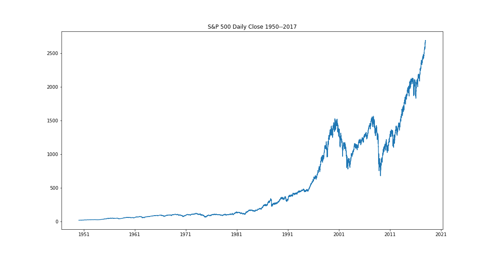
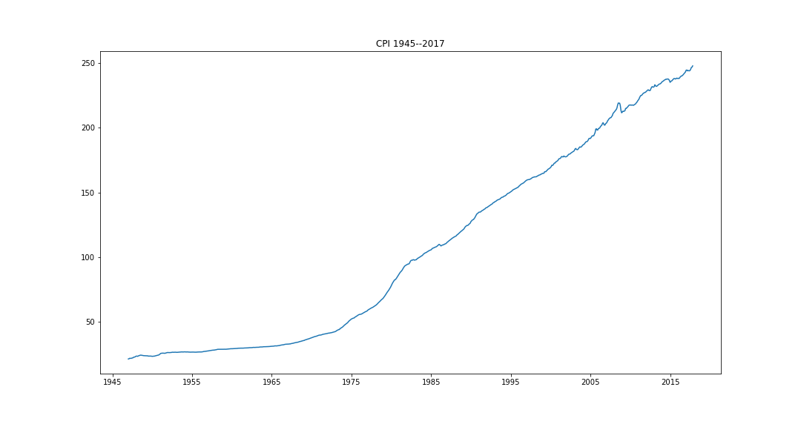
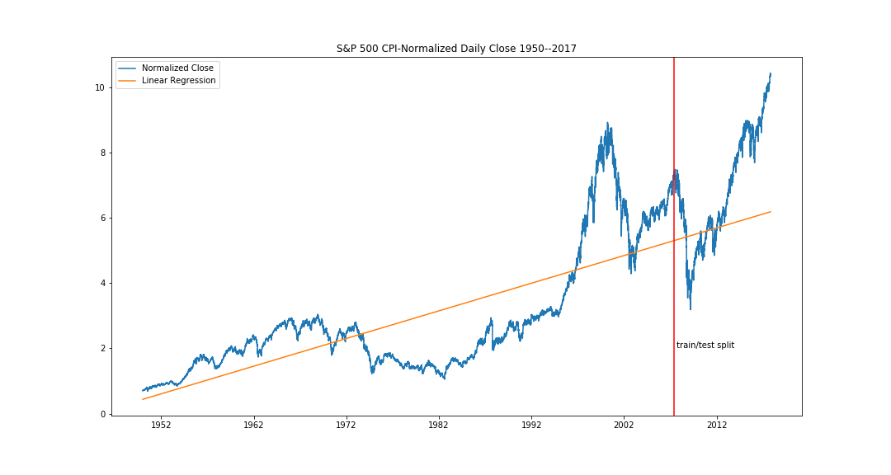
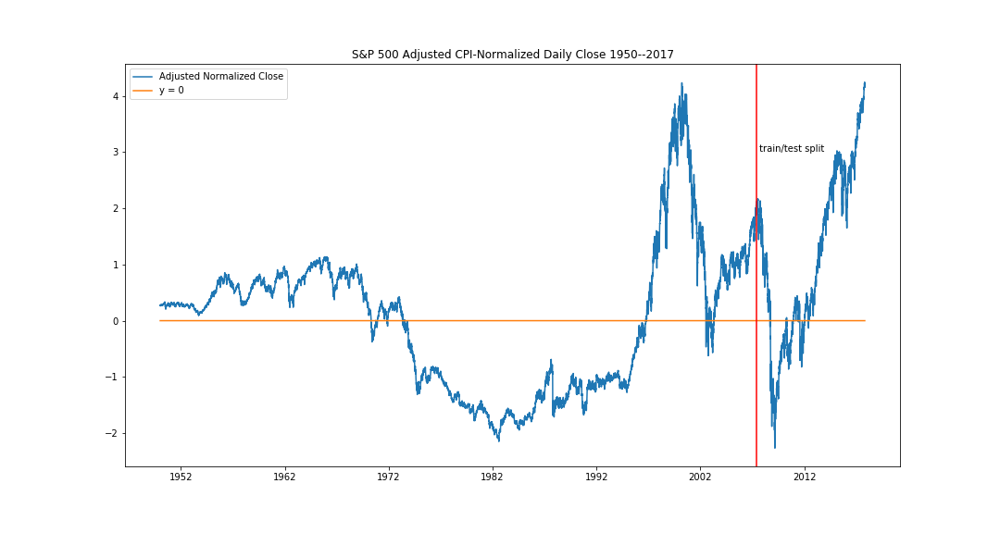
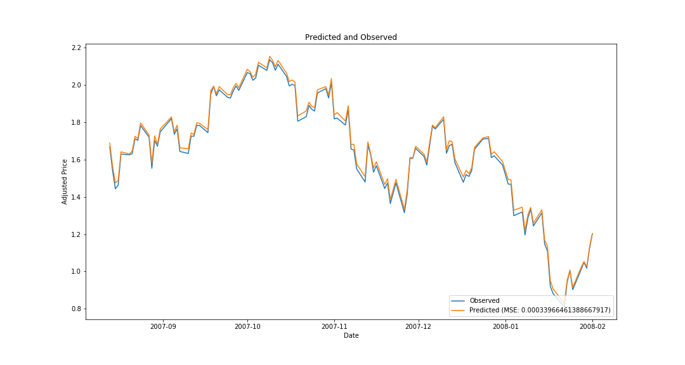
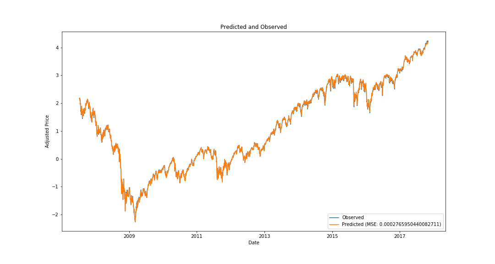

# TensorFlow LSTM

In this tutorial, we'll create an LSTM neural network using time series data (
historical S&P 500 closing prices), and then deploy this model in ModelOp Center. The
model will be written in Python (3) and use the TensorFlow library.
[An excellent introduction to LSTM networks can be found on Christopher Olah's blog.](http://colah.github.io/posts/2015-08-Understanding-LSTMs/)

## Contents

1. [The Dataset](#the-dataset)
2. [Generating Training Data](#generating-training-data)
3. [Implementing the Model in TensorFlow](#implementing-the-model-in-tensorflow)
4. [Preparing the Model for Deployment](#preparing-the-model-for-deployment)
5. [Deploying the Model in ModelOp Center](#deploying-the-model-in-ModelOp Center)

## The Dataset

The model we're building will predict the closing price of the S&P 500, based
on previous days' closing prices. So, the primary dataset will be a collection
of daily S&P closing prices ([download it here](https://s3-us-west-1.amazonaws.com/ModelOp Center-examples/tf_lstm_data.tar.gz)). Let's take a
look at this dataset.

First, import the necessary libraries:
```python
import pandas as pd
import matplotlib.pyplot as plt
import random
import datetime
import numpy as np
%matplotlib inline
```

Then, let's read in the data, make sure every price is indexed by date, and plot
it:
```python
sp500 = pd.read_csv('sp500.csv')

# Convert to Date
sp500['Date'] = pd.to_datetime(sp500['Date'])
sp500 = sp500.set_index('Date')

plt.figure(figsize=(15, 8))
plt.title('S&P 500 Daily Close 1950--2017')
plt.plot(sp500.index, sp500['Close'])
```



There's a small problem with this dataset: the price is expressed in dollars,
and the value of the dollar has changed over time. A reasonable proxy for the dollar
value is the consumer price index---let's rescale our S&P 500 closing prices by
this data. [The CPI dataset can be downloaded here.](https://s3-us-west-1.amazonaws.com/ModelOp Center-examples/tf_lstm_data.tar.gz)

```python
cpi = pd.read_csv('CPIAUCSL.csv')

cpi['DATE'] = pd.to_datetime(cpi['DATE'])
cpi = cpi.set_index('DATE')

plt.figure(figsize=(15, 8))
plt.title('CPI 1945--2017')
plt.plot(cpi.index, cpi['CPIAUCSL'])
```



The CPI data is only reported monthly, whereas our S&P 500 data is reported daily.
To estimate the CPI on a particular day, linearly interpolate between the values:
```python
cpi = cpi.resample('B').asfreq().interpolate()
```

Now, we're ready to rescale by the CPI, and drop any missing values from our
dataset:
```python
sp500['Normalized Close'] = sp500['Close']/cpi['CPIAUCSL']
sp500 = sp500.dropna() # drop any missing values
```

Let's split the dataset up into training and test data by picking a date cutoff.
For this example, we'll pick June 1, 2007:
```python
split_date = datetime.date(2007, 6, 1)

training_data = sp500[:split_date]
test_data = sp500[split_date:]
```

A further normalization step we can perform for time-series data is to subtract
off the general linear trend (which, for the S&P 500 closing prices, is
generally positive, even after rescaling by the CPI). This is analogous
to recentering non-time-series data. The linear trend is easily computed with
`scikit-learn`:

```python
from sklearn.linear_model import LinearRegression

dates_to_array = lambda df: (df.index - df.index.min())/np.timedelta64(1, 'D')

sp500_linear_training_data = training_data['Normalized Close']
sp500_linear_training_dates = dates_to_array(sp500_linear_training_data)
linear_X = np.array(sp500_linear_training_dates).reshape(-1, 1)
linear_y = np.array(sp500_linear_training_data).reshape(-1, 1)

linear_reg = LinearRegression()
linear_reg = linear_reg.fit(linear_X, linear_y)
```

Here's a plot of the CPI-normalized data, the positive linear trend, and the
train/test split date:
```python
linear_preds = linear_reg.predict(np.array(dates_to_array(sp500)).reshape(-1, 1))[:,0]

plt.figure(figsize=(15, 8))
plt.title('S&P 500 CPI-Normalized Daily Close 1950--2017')
plt.plot(sp500.index, sp500['Normalized Close'], label='Normalized Close')
plt.plot(sp500.index, linear_preds, label='Linear Regression')
plt.axvline(x=split_date, color='r')
plt.text(split_date, 2, " train/test split")
plt.legend()
```



Generate our actual train and test data by subtracting off the linear regression's
predictions:

```python
sp500['Adjusted Normalized Close'] = sp500['Normalized Close'] - linear_preds
```

A plot of the train and test data is below.
```python
plt.figure(figsize=(15, 8))
plt.title('S&P 500 Adjusted CPI-Normalized Daily Close 1950--2017')
plt.plot(sp500.index, sp500['Adjusted Normalized Close'], label='Adjusted Normalized Close')
plt.plot(sp500.index, [0 for i in range(0, len(sp500))], label='y = 0')
plt.axvline(x=split_date, color='r')
plt.text(split_date, 3, " train/test split")
plt.legend()
```



## Generating Training Data

A standard approach when building a time-series model is to choose training instances
consisting of randomly selected sequences of fixed length, and the target sequence
for an input sequence is that same sequence shifted by one time step into the future.
For example, if the time series consists of values `[1, 2, 3, 4, 5]`, and we are
training a model to predict the next item in the series from the previous 3 items,
our model should map the input `[2, 3, 4]` to the output `[3, 4, 5]`.

Since we're only interested in predicting the adjusted CPI-normalized closing
price, let's rebind our training and test data variables:

```python
training_data = sp500[:split_date]['Adjusted Normalized Close']
test_data = sp500[split_date:]['Adjusted Normalized Close']
```

We'll need to generate batches of such training inputs from our time series data,
so let's define a function to do so:

```python
def make_training_sequences(array, batch_size, n_steps = 30, seed = 2017):
    """
    Create batches of training data for the model. Sequences are time-ordered.
    """
    X_batch, y_batch = [],[]
    size = len(array)
    random.seed(seed)
    indices = sorted(random.sample(range(0, size - n_steps - 1), batch_size))
    for start in indices:
        x_slice = array[start:start + n_steps]
        y_slice = array[start + 1: start + n_steps + 1]
        X_batch.append(x_slice)
        y_batch.append(y_slice)
    return np.array(X_batch).reshape(-1, n_steps, 1), np.array(y_batch).reshape(-1, n_steps, 1)
```

This function accepts several inputs:

* `array` is the input time series data, as an array.
* `batch_size` is the number of training sequence pairs to generate.
* `n_steps` is the size of each sequence in the training sequence pair, i.e., the
  number of previous values the model should use to compute the next value.
* `seed` is a random seed to use. Fixing the seed will make training data
  generation reproducible.

## Implementing the Model in TensorFlow

With our input data scaled and normalized, and a function defined to generate
training data, we're now ready to build our model. Begin by importing TensorFlow:
```python
import tensorflow as tf
```

Let's specify the parameters of our model:

```python
n_steps = 30
n_inputs = 1
n_outputs = 1
n_layers = 3
n_units = 100
save_name = 'tf_sp500_lstm'
```

These variables control the topology of our neural net:

* `n_steps` is the number of previous data points to use when making a prediction.
  In this case, we have chosen 30, so our model will use the previous 30 business
  days' worth of adjusted S&P 500 close prices to predict the next one. This is
  also the number of stages in the "unrolled" neural net.
* `n_inputs` is the number of features in each input---in this case, just one (the
   adjusted closing price).
* `n_outputs` is the number of features in each output (also one, for the same
   reason).
* `n_layers` is the number of hidden layers in our neural net.
* `n_units` is the number of units in each LSTM cell in our model. This determines
  the number of neurons in the network.
* `save_name` is the filename we'll save our trained model to.

Now, let's initialize the model's graph:

```python
graph = tf.Graph()

with graph.as_default() as g:
    X = tf.placeholder(tf.float32, [None, n_steps, n_inputs])
    y = tf.placeholder(tf.float32, [None, n_steps, n_outputs])

    layers = [tf.contrib.rnn.BasicLSTMCell(num_units = n_units) for k in range(n_layers)]

    cell = tf.contrib.rnn.OutputProjectionWrapper(
      tf.contrib.rnn.MultiRNNCell(layers), output_size = n_outputs)

    outputs, states = tf.nn.dynamic_rnn(cell, X, dtype=tf.float32)

    saver = tf.train.Saver()
```

We'll train the model with the mean squared error (MSE) as our loss function,
using the Adam optimizer. The other parameters for the training process are the
learning rate, number of iterations, batch size, and the random seed for the
`make_training_sequences` function.

```python
seed = 2017
learning_rate = 0.001
n_iterations = 1500
batch_size = 100

with graph.as_default() as g:
    tf.set_random_seed(seed)
    np.random.seed(seed)
    loss = tf.reduce_mean(tf.square(outputs - y))
    optimizer = tf.train.AdamOptimizer(learning_rate = learning_rate)
    training_op = optimizer.minimize(loss)

    init = tf.global_variables_initializer()

    with tf.Session(graph = graph) as sess:
        init.run()
        for iteration in range(n_iterations):
            X_batch, y_batch = make_training_sequences(training_data,
                                batch_size, n_steps, seed + iteration)
            sess.run(training_op, feed_dict = {X: X_batch, y: y_batch})
            if iteration % 100 == 0:
                mse = loss.eval(feed_dict = {X: X_batch, y: y_batch})
                print(iteration, "\tMSE:", mse)
        saver.save(sess, './{}'.format(save_name))

```

With the settings above on a moderately powerful machine, the training process
takes ~5 minutes, and the model converges to a MSE of about 0.0013. The trained
model is saved to `tf_sp500_lstm`.

Generating predictions with the model is straightforward:

```python
def predict(inputs):
    """
    Make predictions based on the input inputs. If len(inputs) = n_steps, makes one prediction (the next item in the series).
    If len(inputs) < n_steps, doesn't make any predictions. If len(inputs) > n_steps, makes len(inputs) - n_steps + 1 predictions.
    """
    if len(inputs[0,:,0]) < n_steps:
        raise Exception("Insufficient inputs! X should be an array of shape (1, k, 1) where k >= n_steps")

    with tf.Session(graph = graph) as sess:
        saver.restore(sess, './{}'.format(save_name))

        preds = []
        steps_forward = len(inputs[0,:,0]) - n_steps + 1
        for j in range(0, steps_forward):
            X_in = inputs[:,j:j+n_steps,:]
            y_pred = sess.run(outputs, feed_dict = {X: X_in})
            preds.append(y_pred[0,-1,0]) # add the last one
    return np.array(preds).reshape(-1, len(preds), 1)
```

Let's define a function to plot the model's predictions:

```python
def plot_predict_date(date, data, steps_forward = 1):
    in_data = data[date:].iloc[0:n_steps + steps_forward - 1]
    true_data = in_data.iloc[n_steps - 1:]
    X_in = np.array(in_data).reshape(-1, len(in_data), 1)
    y_pred = predict(X_in)

    fig = plt.figure(figsize=(15, 8))
    plt.title("Predicted and Observed")
    plt.plot(true_data.index, true_data, label="Observed")
    mse = np.square(y_pred[0,:,0] - true_data).mean()
    plt.plot(true_data.index, y_pred[0, :, 0], label="Predicted (MSE: {})".format(mse))
    plt.legend(loc = "lower right")
    plt.xlabel("Date")
    plt.ylabel("Adjusted Price")
```

Here's what the predictions look like for the first 120 business days after July 1, 2007:

```python
plot_predict_date(datetime.date(2007,7,1), sp500['Adjusted Normalized Close'], steps_forward = 120)
```



We can also see how we did against all of the test data (the dates after June 1, 2007,
denoted by `split_date`).

```python
test_steps = len(sp500[split_date:])
plot_predict_date(split_date, sp500['Adjusted Normalized Close'], steps_forward = test_steps)
```



We've achieved a MSE of 0.00028 on our test data, which is pretty good
given that the model was only trained on pre-crisis data.

## Preparing the Model for Deployment

Deploying our trained model in ModelOp Center is straightforward. A ModelOp Center Python
model script must define an `action` method, and may additionally define `begin`
and `end` methods for intialization/uninitialization, as well as any user-defined
functions or imports needed.

For initialization, we'll define a `begin` function that creates all of the
same TensorFlow variables we constructed for model training, and initializes
our session:

```python
def begin():
    tf.logging.set_verbosity(tf.logging.WARN)

    global past_days
    past_days = []

    global n_steps, X, outputs, sess
    n_steps = 30
    n_inputs = 1
    n_outputs = 1
    n_layers = 3
    n_units = 100
    save_name = 'tf_sp500_lstm'

    X = tf.placeholder(tf.float32, [None, n_steps, n_inputs])
    y = tf.placeholder(tf.float32, [None, n_steps, n_outputs])
    layers = [tf.contrib.rnn.BasicLSTMCell(num_units = n_units) for k in range(n_layers)]
    cell = tf.contrib.rnn.OutputProjectionWrapper(
      tf.contrib.rnn.MultiRNNCell(layers), output_size = n_outputs)
    outputs, states = tf.nn.dynamic_rnn(cell, X, dtype=tf.float32)
    saver = tf.train.Saver()
    sess = tf.Session()
    saver.restore(sess, './{}'.format(save_name))
```

Using the `global` keyword makes all of these variables accessible later in
other methods. We also have a `past_days` variable---when deployed, this model
will receive individual prices as inputs, and we'll accumulate the last 30 of them
in `past_days`. In contrast to the model training code, we're not using context
management to control our TensorFlow session---instead, the session is manually
started in the `begin` method, and we'll manually close it at the end of the
model run with the `end` method:

```python
def end():
    sess.close()
```

Next, let's copy our `predict` method over from the model testing, and make some
slight modifications:

```python
def predict(inputs):
    if len(inputs[0,:,0]) < n_steps:
        raise Exception("Insufficient inputs! X should be an array of shape (1, k, 1) where k >= n_steps")

    preds = []
    steps_forward = len(inputs[0,:,0]) - n_steps + 1
    for j in range(0, steps_forward):
        X_in = inputs[:,j:j+n_steps,:]
        y_pred = sess.run(outputs, feed_dict = {X: X_in})
        preds.append(y_pred[0,-1,0]) # add the last one
    return np.array(preds).reshape(-1, len(preds), 1)
```

The `predict` method has been slightly simplified: we no longer restore the session
from the save file (it is already restored and opened in the `begin` method), but
is otherwise identical.

Finally, the `action` method is the hook that the ModelOp Center engine uses to produce
scores. It will take as input a closing price, and produce as output the prediction
for the next day's closing price.

```python
def action(x):
    global past_days
    past_days.append(x)
    past_days = past_days[-n_steps:]
    if len(past_days) == n_steps:
        result = predict(np.array(past_days).reshape(-1, n_steps, 1))[0, 0, 0]
        yield np.asscalar(result)
```

Because the TensorFlow model uses 30 days' worth of prices to make predictions,
we need to keep track of the last 30 inputs received. (Recall that the 30 days is
determined by the `n_steps` variable). Tracking the previous inputs is handled by
`past_days`, which was initialized in the `begin` method to an empty
list. As written, the model will only produce output when it has accumulated enough
inputs to make a prediction. The result is cast to a standard Python `float` (
from NumPy's `float32`) to ensure compatibility with data serialization (e.g.,
JSON).

The inputs and outputs of this model will be Avro doubles, so let's add smart comments
to the top of the model code to indicate this. We'll also be manually controlling the
version of TensorFlow we install, so we'll use the `ModelOp Center.module-attached` smart
comment to indicate that the engine should not attempt to install TensorFlow automatically.
In total, our ModelOp Center-ready model is:

```python
# ModelOp Center.schema.0: double
# ModelOp Center.schema.1: double
# ModelOp Center.module-attached: tensorflow

import tensorflow as tf
import numpy as np

def begin():
    tf.logging.set_verbosity(tf.logging.WARN)

    global past_days
    past_days = []

    global n_steps, X, outputs, sess
    n_steps = 30
    n_inputs = 1
    n_outputs = 1
    n_layers = 3
    n_units = 100
    save_name = 'tf_sp500_lstm'

    X = tf.placeholder(tf.float32, [None, n_steps, n_inputs])
    y = tf.placeholder(tf.float32, [None, n_steps, n_outputs])
    layers = [tf.contrib.rnn.BasicLSTMCell(num_units = n_units) for k in range(n_layers)]
    cell = tf.contrib.rnn.OutputProjectionWrapper(
      tf.contrib.rnn.MultiRNNCell(layers), output_size = n_outputs)
    outputs, states = tf.nn.dynamic_rnn(cell, X, dtype=tf.float32)
    saver = tf.train.Saver()
    sess = tf.Session()
    saver.restore(sess, './{}'.format(save_name))

def predict(inputs):
    if len(inputs[0,:,0]) < n_steps:
        raise Exception("Insufficient inputs! X should be an array of shape (1, k, 1) where k >= n_steps")

    preds = []
    steps_forward = len(inputs[0,:,0]) - n_steps + 1
    for j in range(0, steps_forward):
        X_in = inputs[:,j:j+n_steps,:]
        y_pred = sess.run(outputs, feed_dict = {X: X_in})
        preds.append(y_pred[0,-1,0]) # add the last one
    return np.array(preds).reshape(-1, len(preds), 1)

def action(x):
    global past_days
    past_days.append(x)
    past_days = past_days[-n_steps:]
    if len(past_days) == n_steps:
        result = predict(np.array(past_days).reshape(-1, n_steps, 1))[0, 0, 0]
        yield np.asscalar(result)

def end():
    sess.close()
```

Note that we'll additionally need to bundle the `tf_sp500_lstm` TensorFlow session
checkpoints with our model in order for it to execute in ModelOp Center; to do this,
save the checkpoint as a model attachment:
```bash
tar czvf attachment.tar.gz tf_sp500_lstm*
```

## Deploying the Model in ModelOp Center

Finally, let's deploy our ModelOp Center-ready model into the ModelOp Center engine. First,
we'll need to create a custom engine image with the specific environment we used
to create this model. Create a text file called `requirements.txt`, and include
the following:

**requirements.txt**
```
numpy==1.13.3
pandas==0.20.2
tensorflow==1.4.0
```
Adjust the specific versions of the libraries to match the versions in
your working environment. (Use `pip freeze | grep <library-name>` to find out
what version of a library you have installed.)

Next, let's build a custom Docker container image from the base engine image:

**Dockerfile**
```
FROM ModelOp Center/engine:1.6.1
ADD ./requirements.txt .
RUN pip3 install --isolated -r requirements.txt
```

We're starting with the 1.6.1 ModelOp Center engine image, and then installing the
the libraries listed in `requirements.txt`.

To build the container image, just run
```
docker build -t localrepo/engine:tensorflow .
```
from within the same directory as the Dockerfile and `requirements.txt` file.

All that's needed to add a custom TensorFlow-ready engine to your fleet is
to run the engine container and update your ModelOp Center fleet's configuration to
include the new engine. If you're starting from scratch, we have prepared a Docker-Compose
file together with some shell scripts to build a full ModelOp Center fleet with the
custom container image. [Download the files here.](https://s3-us-west-1.amazonaws.com/ModelOp Center-examples/tf_lstm_ModelOp Center.tar.gz)

To add our model to Model Manage, you may directly upload the files using the
Dashboard, or run the following commands with the CLI:
```
ModelOp Center schema add double double.avsc
ModelOp Center model add -type:python3 tf_sp500_lstm tf_sp500_lstm.py
ModelOp Center attachment upload tf_sp500_lstm attachment.tar.gz
ModelOp Center stream add rest rest.json
```
where `double.avsc` is the Avro schema file

**double.avsc**
```json
{"type": "double"}
```

and `rest.json` is the stream descriptor:

**rest.json**
```json
{
  "Transport": "REST",
  "Encoding": "json"
}
```

Note that we have to add the `-type:python3` option when adding our model to
Model Manage (otherwise, the engine will assume it is a Python 2 model).

Next, deploy the model with the following commands:
```
ModelOp Center model load tf_sp500_lstm
ModelOp Center stream attach rest 1
ModelOp Center stream attach rest 0
```

The numbers in the `stream attach` command indicate the slot number to use for that
stream: 0 is the default input stream, and 1 is the default output stream. Models
with multiple data sources or multiple outputs may take advantage of multiple stream
slots, but as designed our model only takes in data from a single source and produces
a single output stream.

Now the model is exposed on the engine's REST endpoint, and can be used for scoring.
Use the `ModelOp Center model input` command to deliver inputs to the model, and
`ModelOp Center model output` to retrieve outputs (for asynchronous REST scoring).
In this case, the model is configured to use asynchoronous REST because it needs
to receive 30 inputs before it can start producing output.

[Download scripts here to demonstrate how to produce scores with this model.](https://s3-us-west-1.amazonaws.com/ModelOp Center-examples/tf_lstm_ModelOp Center.tar.gz)

Happy scoring!

## Further Reading

* [C. Olah: Understanding LSTMs](http://colah.github.io/posts/2015-08-Understanding-LSTMs/)
* [A. Geron: Hands-On Machine Learning with Scikit-Learn and TensorFlow](https://www.amazon.com/Hands-Machine-Learning-Scikit-Learn-TensorFlow/dp/1491962291)
