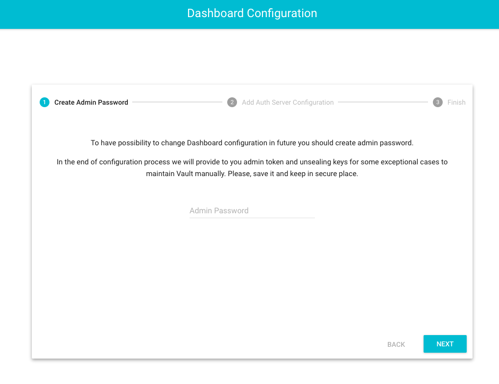
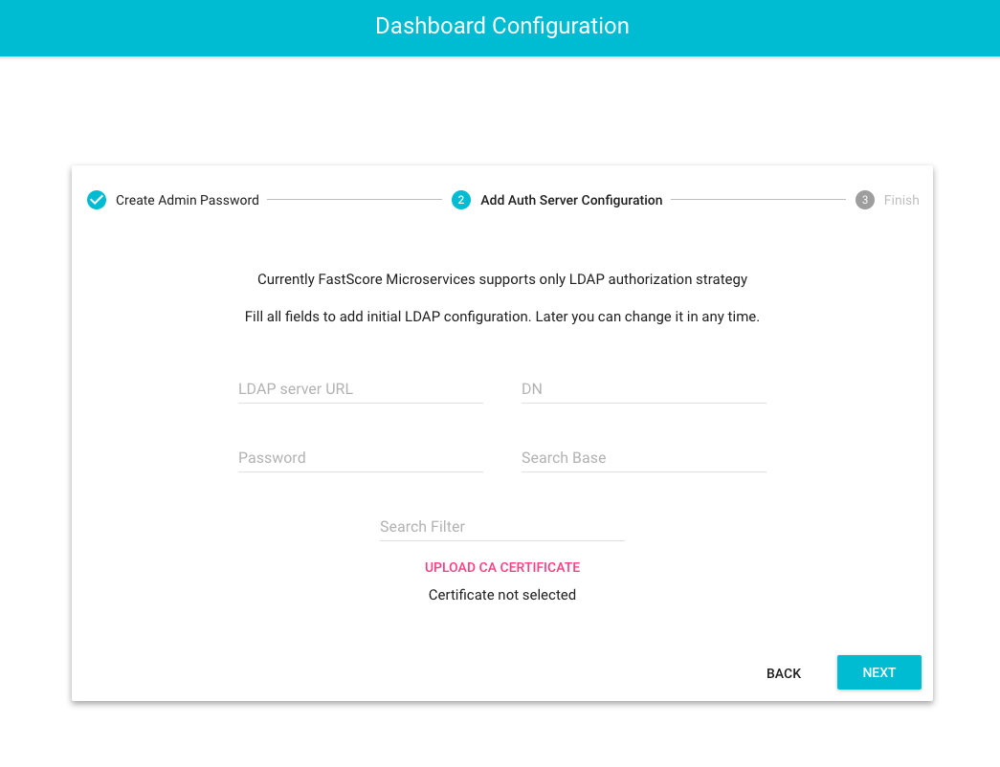
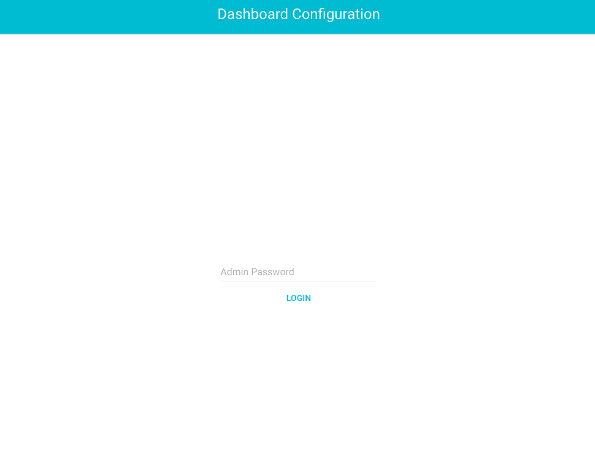

# LDAP Authentication

Starting with FastScore v1.4, the FastScore Dashboard and Proxy support Microsoft Active Directory user authentication using [Vault](https://www.vaultproject.io/). To achieve this functionality, FastScore uses Vault to securely store the Active Directory configuration details. This page describes how to make use of authentication in FastScore.

## Connecting FastScore to Vault


This section assumes you already possess an existing Vault service. If you haven't configured Vault yet, [read the Vault configuration section below](#configuring-vault-in-docker).

Authentication in FastScore is achieved through the Dashboard service. Recall from the [Getting Started Guide](https://opendatagroup.github.io/Guides/Getting%20Started%20with%20FastScore%20v1-6-1.html) that Dashboard is designed to serve as a proxy for the FastScore fleet's REST API, as well as a visual configuration and diagnostic aid. By default, authentication is not enabled in Dashboard. To enable it, set the following environment variables:

| Name | Default Value | Description |
| --- | --- | --- |
| `AUTH_SERVICE` | (none) | Set to `ldap` to enable authentication. |
| `VAULT_HOST` | `127.0.0.1` | The Vault server IP or hostname. |
| `VAULT_PORT` | `8200` | The Vault server port. |
| `VAULT_TOKEN` | (none) | Token which should be used for access to the Vault. |
| `VAULT_SSL` | `false` | Whether or not to use SSL with the Vault. |
| `VAULT_SSL_VERIFY` | `false` | Whether to validate SSL requests. |
| `VAULT_CACERT` | (none) | Path to the CA certificate. |


As seen from this table, the Dashboard must be provided with the Vault token and CA certificate to connect to the Vault. Generating the Vault token is discussed in the next section.

### Authentication in the CLI

The latest version of the FastScore CLI supports the authentication scheme described above. Usernames and passwords can be passed to the FastScore CLI's `connect` command. For example, the command

```
fastscore connect https://dashboard-ip:8000 foo:bar
```
attempts to authenticate with username "foo" and password "bar". If the password is omitted, the user will be prompted to enter it at the command line.

Note that the FastScore CLI will save the authentication secret to the file "`.fastscore`" located in the current working directory. 

### Authentication with the REST API

To authenticate via the REST API, use a POST request to `/1/login` with the username and password, e.g.,

```
POST /1/login HTTP/1.1
Host: localhost:3000
Content-Type: application/x-www-form-urlencoded
 
username=admin&password=admin
```

If the user has been successfully authenticated, the request will return **200 OK** together with cookies. After authorization, all subsequent requests should contain the cookie. 

If the REST API command fails, it may return the following error codes:

* 401: Returned if the user has no access to LDAP, or the wrong credentials were sent.
* 500: Returned if there's an LDAP server configuration error, or the server is not reachable.

### Authentication with the Dashboard

Entry point to configuration is https://localhost:3000/configuration
At first you will be automatically redirect to the create configuration page. After initial configuration users can change the LDAP configuration via the configuration page.

The user should create an admin password and set up the initial LDAP configuration. 




At the end of configuration create process the user will see a Root Token and Unseal Key for manual manipulating with Vault in case any errors occur or maintenance is needed. 


Below is the Admin login page.  


## <a name="configuring-vault-in-docker"></a> Configuring Vault in Docker

In order to use authentication with the Dashboard, you need to have Vault running. Vault is a secure credentials repository, and it can be run either as a native binary, or in a Docker container. In this segment, we'll use the latter option. 

### Setting up the Vault Container

Use the following Docker-Compose file to start the Vault container:

``` yaml
version: '2'
services:
 vault:
    image: vault:latest
    network_mode: "host"
    tty: true
    stdin_open: true
    command: server
    cap_add:
      - IPC_LOCK
 # uncomment these lines if you're using aufs
 #   environment:
 #     SKIP_SETCAP: "True"
    volumes:
      - ./vault-config:/vault/config
```

Note that compose file links the local directory `vault-config` to the corresponding directory `/vault/config` in the container. This can be used to load configuration files and certificates into the Vault container. Additionally, the environment variable `SKIP_SETCAP` is currently commented out---uncomment this if you're using Docker's `aufs` filesystem (as of v0.6.3, there are some issues using `IPC_LOCK` on an `aufs` Docker filesystem).

Inside of the `vault` directory, create a subdirectory named `config` and put your Vault configuration file there. An example Vault configuration file might look like:

``` yaml
{
    "backend": {
      "file": {
        "path": "/vault/file"
      }
    },
    "listener": {
      "tcp": {
        "address": "0.0.0.0:8200",
        "tls_disable": 0,
        "tls_cert_file": "/vault/config/server.crt",
        "tls_key_file": "/vault/config/server.key"
      }
    },
  "default_lease_ttl": "168h",
  "max_lease_ttl": "720h",
  "disable_mlock": true
}
```

In this configuration file, `server.crt` and `server.key` are your server's certificate and key---add these files to the `vault-config` folder as well.

Start the vault container with
```
docker-compose -f vault-compose.yml up -d
```

You can check that this worked with `docker-compose -f vault-compose.yml logs vault`, the output should look similar to:
```
Attaching to auth_vault_1
vault_1         | ==> Vault server configuration:
vault_1         | 
vault_1         |                  Backend: file
vault_1         |                      Cgo: disabled
vault_1         |               Listener 1: tcp (addr: "0.0.0.0:8200", cluster address: "")
vault_1         |                Log Level: info
vault_1         |                    Mlock: supported: true, enabled: false
vault_1         |                  Version: Vault v0.6.5
vault_1         |              Version Sha: 5d8d702f33b5fd965cbe8d6d0728295de813a196
vault_1         | 
vault_1         | ==> Vault server started! Log data will stream in below:
vault_1         | 
```

### <a name="configuring-vault"></a>Configuring Vault

The Vault container can be interacted with through both a CLI and a REST API. For simplicity, we'll focus on using the CLI. All CLI commands can be executed on both a local machine, or within the Vault container itself---we'll use `docker exec` to run the commands within the container.

Initialize the container with `vault init -key-threshold=1 -key-shares=1`:
```
docker-compose exec vault vault init -key-threshold=1 -key-shares=1
```
If this command succeeds, it should display the following:
```
Unseal Key 1: [Unseal Key]
Initial Root Token: [Root Token]

Vault initialized with 1 keys and a key threshold of 1. Please
securely distribute the above keys. When the Vault is re-sealed,
restarted, or stopped, you must provide at least 1 of these keys
to unseal it again.

Vault does not store the master key. Without at least 1 keys,
your Vault will remain permanently sealed.
```
Make sure to record `[Unseal Key]` and `[Root Token]`---we'll need them later! 

Use the `[Unseal Key]` to unseal the vault:
```
docker-compose exec vault vault unseal [Unseal Key]
```
The response will be similar to:
```
Sealed: false
Key Shares: 1
Key Threshold: 1
Unseal Progress: 0
Unseal Nonce: 
```

Now that the Vault is unsealed, authenticate using the `[Root Token]`:
```
docker-compose exec vault vault auth [Root Token]
```
You should see a message of successful authentication:
```
Successfully authenticated! You are now logged in.
token: [Root Token]
token_duration: 0
token_policies: [root]
```

Next, add the LDAP configuration information to the Vault. This is the information Dashboard will use to connect to your Active Directory server, so you'll need to customize it appropriately:
```
docker-compose exec vault vault write secret/ldap-configuration \
bindCredentials="password" \
bindDn="CN=mtwain,CN=Users,DC=odg,DC=local" \
searchBase="dc=odg,dc=local" \
searchFilter="(&(SamAccountName={{username}})" \
url="ldap://odgad.odg.local:3269"
```
If the command succeeds, the Vault will respond with
```
Success! Data written to: secret/ldap-configuration
```
In order to make this accessible from the Dashboard, we'll have to create an access policy. Our policy is configured with the file:

```
path "secret/ldap-configuration" {
    policy = "read"
}


path "secret/ldap-configuration" {
    policy = "read"
}
```

Set the policy for the `ldap-configuration` secret by copying the file `policy.hcl` to `vault-config` and running the command:
```
docker-compose exec vault vault policy-write dashboard-service-policy /vault/config/policy.hcl
```

The Dashboard will also need an LDAP certificate to connect to your LDAP Directory server over secure SSL-encrypted LDAP protocol. Copy this certificate over to the Vault container, either by placing it in the `vault-config` directory, or with `docker cp`:
```
docker cp ldap-ca-certificate.ca vault:/vault/config/
```
and write the certificate to the secret:
```
docker-compose exec vault vault write secret/ldap-ca-certificate \
value=@/vault/config/ldap-ca-certificate.ca
```

Finally, we enable `approle` and add the Dashboard policy from above:
```
docker-compose exec vault vault auth-enable approle
```
The response will be
```
Successfully enabled 'approle' at 'approle'!
```
Add the Dashboard service policy:
```
docker-compose exec vault vault write auth/approle/role/dashboard-service-role \ 
policies="dashboard-service-policy"
```
and capture the role ID and secret ID:
```
docker-compose exec vault vault read auth/approle/role/dashboard-service-role/role-id
docker-compose exec vault vault read -f \
auth/approle/role/dashboard-service-role/secret-id
```
The response will be:
```
Key     Value
---     -----
role_id [role_id]
```
and
```
Key                     Value
---                     -----
secret_id               [secret_id]
secret_id_accessor      [secret_id_accessor]
```

Add the `role_id` and `secret_id` to the Dashboard service in Vault:
```
docker-compose exec vault vault write auth/approle/login role_id=[role_id] secret_id=[secret_id]
```

## Authorized Users

In the [section on Configuring Vault](#configuring-vault), we have provided an example configuration to connect to Microsoft Active Directory. Other LDAP-enabled directories will be supported as well. We have stored the following details in Vault in order to properly authenticate and authorize users:

* Distinguished name of a user that has read access to your directory:
```
bindDn="CN=mtwain,CN=Users,DC=odg,DC=local"
```
* Password of the above user:
```
bindCredentials="password"
```
* Root of the directory tree where users reside:
```
searchBase="dc=odg,dc=local"
```
* The search filter defining which attribute maps to username and criteria for user authorization:
```
searchFilters="(&(SamAccountName={{username}})(memberOf=CN=fastscore-dashboard-users,CN=Users,DC=odg,DC=local))"
```
* LDAP URL defining the protocol (`ldap` or `ldaps`, server address, and port):
```
url="ldaps://odgad.odg.local:3269"
```

Based on the above configuration, only users that are members of `fastscore-dashboard-users` will be allowed to log in. This means that providing a valid username and password is not sufficient. You should also add the user to `fastscore-dashboard-users` in your directory.

You can also decide to use a different directory attribute as username. If, for example, you would like users to log in with their email addresses, you need to replace `"SamAccountName"` with `"mail"`:
```
searchFilter="$(mail={{username}})(memberOf=CN=fastscore-dashboard-users,CN=Users,DC=odg,DC=local))"
```