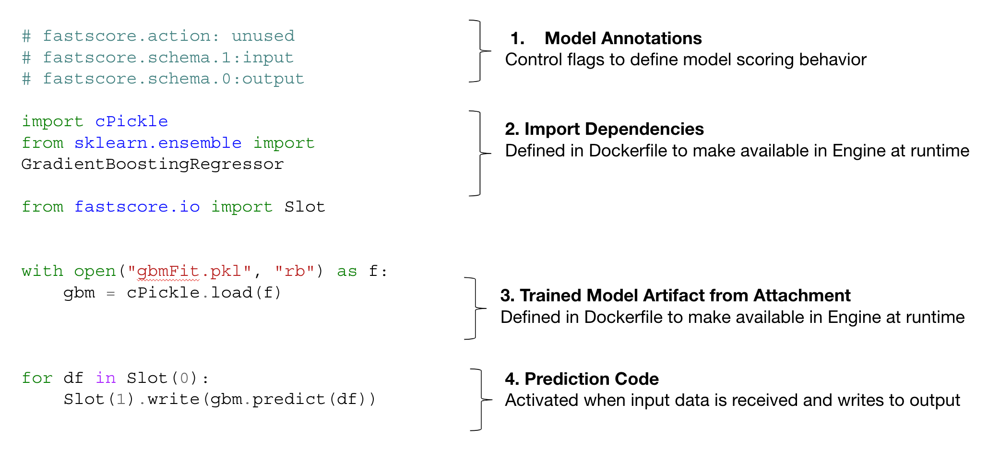

title: "Conform and Deploy a Model"
description: "This is a step by step guide for conforming and deploying a model in FastScore. It contains instructions for data scientists to prepare, deploy and test their model. This guide was last updated for v1.10 of FastScore.\n\nIf you need support or have questions, please email us:  [support@opendatagroup.com](mailto:support@opendatagroup.com)"
---

# Conform and deploying a Model
This is a step by step guide for conforming and deploying a model in FastScore. It contains instructions for data scientists to prepare, deploy and test their model. This guide was last updated for v1.10 of FastScore. 

As we go, we will be referring to an example XGBoost model available in the `examples` branch of this repo (https://github.com/opendatagroup/Getting-Started/tree/examples).

If you need support or have questions, please email us: support@opendatagroup.com

# Contents

1. [Pre-requisites](#Prerequisites)
2. [Defining Deployment Package Overview](#model-deployment-package)
    1. [Model Dependencies](#model-dependencies)
    2. [Model Schema](#model-schema)
    3. [Model Execution Script](#model-execution-script)
    4. [Attachment](#attachments)
3. [Deploy as REST](#Deploy-as-REST)
4. [Test Model](#Test-Model)
5. [Next Steps](#next-steps)

## <a name="Prerequisites"></a>Pre-requisites
Before we walk through how to conform and deploy a model, we will need the following before we begin:

1. [FastScore Environment Installed - [follow this guide](https://opendatagroup.github.io/Getting%20Started/Getting%20Started%20with%20FastScore/)
2. [FastScore CLI Installed](https://opendatagroup.github.io/Getting%20Started/Getting%20Started%20with%20FastScore/#installing-the-fastscore-cli)
3. [Example repo downloaded](https://github.com/opendatagroup/Getting-Started/tree/examples)

This guide walks through a multi-class classification model that determines the species of iris based on four features: sepal length/width, petal length/width using the XGBoost framework. It is available in the repo above. 

To download the repo and setup the environment:

`git clone https://github.com/opendatagroup/Getting-Started.git
cd Getting-Started
git checkout examples
make`
	

## <a name="model-deployment-package"></a>Defining Model Deployment Package
FastScore provides several key assets for deploying and managing a model throughout the Model Lifecycle. As a Data Scientist, we define these abstractions for a robust deployment of our model that can evolve during the productionalization process without intensive input from the Data Scientist downstream.   


| Asset                  | Description                                                                                                                                |
|------------------------|--------------------------------------------------------------------------------------------------------------------------------------------|
| 3. Model Execution Script | Model execution or prediction script that read input data from source, predicts, and writes output.                                        |
| 1. Model Dependencies     | Definition of the Runtime environment of the model with necessary dependencies for execution.                                              |
| 2. Schemas                | The definition of a Model’s type signature for inputs and outputs defined in Avro.                                                         |
| 4. Attachments            | Binary objects, serialized model coefficients from training, that are attached to model and pulled into working directory upon deployment. |
| 5. Streams                | Definition of the data input/ output that a model reads/ writes from/ to while executing (defined by Data Engineer in Dev).                |


## <a name="model-dependencies"></a>1. Model Dependencies
FastScore Engine manages the deployment and running of the model within a Docker container. As part of the deployment process, we will need to build the dependenices for our model on top of the base FastScore Engine container.  This is a key piece for the Data Scientist to hand off to ModelOps to ensure the model can run downstream.  

For our XGBoost example, we will need to build in the dependencies  using the Dockerfile and requirements.txt in `Getting-Started/requirements/xgboost_iris`. To build the image in the local repo, run `docker build -t localrepo/engine:xgboost .` within the directory. We can then modify the docker-compose.yaml to have Engine 1 utilize the new Engine and redeploy with `make deploy`.

Dockerfile
```
FROM fastscore/engine:dev
ADD ./requirements.txt .

RUN pip3 install --isolated --user -r requirements.txt
USER root
RUN apt-get install cmake -y
RUN git clone --recursive https://github.com/dmlc/xgboost && \
	cd /fastscore/xgboost && \
	mkdir build && \
	cd /fastscore/xgboost/build && \
	cmake .. && \
	make -j4 && \
	cd /fastscore/xgboost/python-package &&\
	python3 setup.py install
USER 1000
```

Requirements.txt
```
numpy==1.16.2
pandas==0.24.2

```

Docker-compose.yaml
```
  engine-1:
    image: localrepo/engine:xgboost
    ports:
        - "8003:8003"
    volumes:
      - ./data:/data
    environment:
        CONNECT_PREFIX: https://connect:8001
    networks:
      - fsnet

```

The image is also avaiable on Dockerhub as `fastscore/engine:xgboost`.

## <a name="model-schema"></a>2. Defining Model Schema
Next, we will define the Schemas for our input and output data. Schemata specify a “language-neutral type signature” for a model. We use these to define the handoff between the model and the data pipeline. Input/ output data will be validated against them and rejected if it does not match, giving us visibility of issues betweeen the model and the data pipeline. FastScore uses [Apache Avro](http://avro.apache.org/docs/current/) and they are defined in JSON files that are added to Model Manage. 

With the FastScore CLI, we can infer the schema from a sample data record using the following command. 

`fastscore schema infer <data-file>`

For our example, we can run the following from the Getting-Started of the `examples` branch for the input schema.

`fastscore schema infer library/scripts/xgboost_iris_inputs.jsons`

This will return the following, which we should save as `xgboost_iris_input.avsc`:
```
{
    "fields": [
        {
            "name": "sepal_length",
            "type": "double"
        },
        {
            "name": "sepal_width",
            "type": "double"
        },
        {
            "name": "petal_length",
            "type": "double"
        },
        {
            "name": "petal_width",
            "type": "double"
        }
    ],
    "name": "recc617457b",
    "type": "record"
}
```

For the output schema, our model will be our prediction as 3 floats which looks like this:
```
{
	"type": "record",
	"name": "xgboost_output",
	"fields": [
		{"name":"A", "type":"float"},
		{"name":"B", "type":"float"},
		{"name":"C", "type":"float"}
	]
}
``` 

We will save the that one as xgboost_iris_output.avsc. 


And now we will add our schemas to Model Manage using the following commands:

`fastscore schema add xgboost_input library/schemas/xgboost_iris_input.avsc`
`fastscore schema add xgboost_output library/schemas/xgboost_iris_output.avsc`

## <a name="model-execution-script"></a>3. Model Execution Script
Next, we're going to define the Model Execution Script, which will determine how the model predicts our output from the input data. This will be the key piece that pulls together and calls the other portions of our deployment package.

Let's look at the portions of our execution script:



We'll need to define several pieces of the model execution script:
1. Model Annotation - Control flags to define model scoring behavior including which schemas are tied to which slots.
2. Import Dependencies - Defined in Dockerfile and imported to make them available in the Engine
3. Trained Model Artifact from Attachment - Loaded and made available for reference at the beginning of the script.
4. Prediction Code - Activated when input data is received and writes to output.


Note: it's best practice to build a 'shell' or echo version of your model to validate the input and output data flow prior to adding in the prediction portions. This will allow us to validate and test the schemata and data flow of the model prior to introducing additional complexity of prediction. For our example, this is the shell model we test:

```Python
#fastscore.action: unused
#fastscore.schema.0: xgboost_input
#fastscore.schema.1: xgboost_output
#fastscore.module-attached: xgboost

from fastscore.io import Slot
import xgboost
import pickle
import pandas as pd
import time

slot0 = Slot(0)
slot1 = Slot(1)

for df in slot0:

	slot1.write(df.to_dict())
```


Next, we add in the pieces for the actual prediction.

```Python
#fastscore.action: unused
#fastscore.schema.0: xgboost_input
#fastscore.schema.1: xgboost_output
#fastscore.module-attached: xgboost

from fastscore.io import Slot
import xgboost
import pickle
import pandas as pd
import time

slot0 = Slot(0)
slot1 = Slot(1)
for df in slot0:
	time.sleep(150)
	features = ['sepal_length', 'sepal_width', 'petal_length', 'petal_width']
	df = df[features]
	model = pickle.load(open('xgboost_explicit.pkl', 'rb'))
	preds = model.predict_proba(data = df)
	preds = pd.DataFrame(preds, columns = ['A', 'B', 'C'])
	for j in range(len(preds)):
		slot1.write(preds.iloc[j,:].to_dict())
```

Here are the options for moodel annotations in FastScore to control the behvaior of the model in FastScore:

| Annotation              | Format                       | Description                                             |
|-------------------------|------------------------------|---------------------------------------------------------|
| Schema Assignment       | `# fastscore.schema.<slot #>: <schema-name>`        | Ties schema to a slot to verify data for that slot      |
| Recordsets              | `# fastscore.recordsets.:<slot #>: <true/false>`     | Enables recordsets for that slot                        |
| Action Unused           | `# fastscore.action: unused`   | Defines conformance approach                            |
| Module Attached         | `# fastscore.module-attached:<module-name>` | Disables the import policy checking for imported module |
| Disable Schema Checking | `# fastscore.schema.:<slot #>: in-use`  | Used during testing to disable schema checking          |

For our example, the first annotation designates we will be using explict conformance rather than call-back conformance. Note: this model and guide focus on a new form of conformance for execution called 'explict conformance'. There is also the ability to utilize 'call-back conformance' which utilizes `begin` and `action` functions instead of the `slot` object as shown in [this example](https://opendatagroup.github.io/Knowledge%20Center/Tutorials/Gradient%20Boosting%20Regressor/). Both will run within the latest versions of the FastScore Engine. 

Our next model annotations ties the input and output schemas to our slots. Lastly, we specify that xgboost is attached to prevent issues with our [Import Policy](https://opendatagroup.github.io/Product%20Manuals/Import%20Policies/).

In the next section of the script, we import the libraries we will need at run time. Note that these need to be made available in our Engine container in [Step 1](#model-dependencies).

Now we define the input and output slot objects. These will control the scoring of the input data but XYZ - I NEED HELP


Once we've defined this, we need to add the model execution script to FastScore with the following command:
`fastscore model add <model-name> <source-file>`
`fastscore model add xgboost_iris-py3 library/models/xgboost_iris.py3`


## <a name="model-execution-script"></a>4. Attachments
Attachments consist of external files to be utilized during prediction or scoring. The contents of the attachment get extracted into the current working directory of the model execution script.  Attachments will be tracked in Model Manage and Git if we're using the integration so they should be under 20 mb. Larger artifacts can be added to the Engine via the Dockerfile. 

In our example, we reference `xgboost_explicit.pkl` which is our trainined model we will reference for predictions. FastScore will unpack the file in the working directory so the model can utilize it. To add it to FastScore, we upload it the model and add it to Model Manage with the following CLI command:

`fastscore attachment upload <model-name> <file-to-attach>`.  
`fastscore attachment upload xgboost_iris-py3 library/attachments/xgboost_explicit.tar.gz`


## <a name="model-execution-script"></a>5. Streams
Streams in FastScore define the integration to our data pipeline. Streams will read records from underlying transport, verifies with the schema, and feeds them to the model. The streams are defined via JSON document that controls behavior and connection. For this example, we will be deploying and testing the model as REST. A full guide for building and deploying streams can be found [here](STREAMGUIDE). 

In the next step, we will use the CLI to generate two arbirtary REST endpoints for testing the model, which is handy for testing. We can also define the REST stream as a JSON file to added and tracked in Model Manage:
``
{
  "Transport": "REST",
  "Encoding": "json"
}
``

``fastscore stream add <stream-name> <file-name>
fastscore stream add rest library/streams/rest.json
``

## <a name="Deploy-as-REST"></a>Deploy as REST
Now that we have the Model Deployment Package defined and added to FastScore, it's time to deploy it in the Engine and test as REST. Using `rest:` for the streams in the run command will generate an endpoint for the input and output slots.  

Generic commands for deploying model:
```
fastscore use <engine-name>
fastscore engine reset
fastscore run <model-name> rest: rest:
fastscore engine inspect
```

For our example:

```
fastscore use engine-1
fastscore engine reset
fastscore run xgboost_iris-py3 rest: rest:
fastscore engine inspect
```

Troubleshooting Tip: At this point, the model is loaded into the Engine, initialized, and awaiting data. The last `inspect` should return `RUNNING` to indicate the model is ready for data. If the `inspect` command returns an error, there was most likely an issue with the[Model Dependencies](#model-dependencies), the [Attachment](#attachments) or how they were referenced in the [Model Execution Script](#model-execution-script). Check the logs of the Engine to investigate the error messages.
 

## <a name="Test-Model"></a>Test Model
Next we're going to send data to the model to test the Model Deployment Package entirely for prediction. To send data via the CLI, we will send samples from the `xgboost_iris_inputs.jsons` file then view ouput using the following commands:

```
head -10 library/scripts/xgboost_iris_inputs.jsons | fastscore model input
fastscore model output
```

Now we can see the outputs from our model!

Troubleshooting Tip: If the output command returns nothing, use `fastscore engine inspect` to see the state of the model. If it's in error, check the docker logs for an error message. At this stage, it's most likely an issue with the [Model Schema](#model-schema) rejecting the data or an issue with the [Model Execution Script](#model-execution-script).


## <a name="next-steps"></a>Next Steps
At this point as a Data Scientist, we can confidently hand off the Model Deployment Package to the Data Engineering or ModelOps team knowing it's ready for operationalization and productionalization. The next step for this model will be [Defining the Streams](#STREAMGUIDE) that integrate with our Data Pipeline. 

To continue learning, check out some additional examples here:
- [Gradient Boosting Regressor](https://opendatagroup.github.io/Knowledge%20Center/Tutorials/Gradient%20Boosting%20Regressor/)
- [TensorFlow LTSM](https://opendatagroup.github.io/Knowledge%20Center/Tutorials/Tensorflow%20LSTM/)


