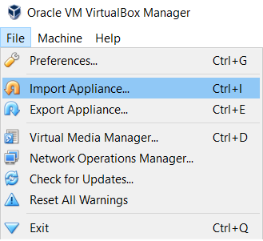
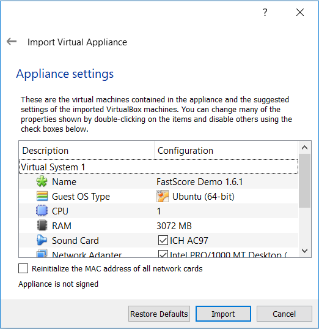
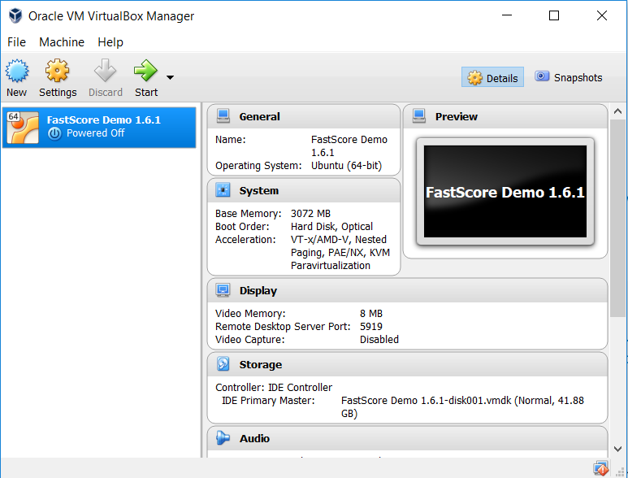

# Quick Start with the ModelOp Center OVA

Get started with ModelOp Center quickly by importing the ModelOp Center Virtual Appliance into the Oracle VirtualBox Manager. We have made it easy by providing you with a pre-configured ModelOp Center fleet and two demos that will walk you through deploying a model with ModelOp Center:

* hello-world example
* Gradient Boosting Machine example
Models, streams, schemas, and data are provided. 

Watch our instructional video [here](https://www.opendatagroup.com/faststart-with-ModelOp%20Center-instructional-video) for more help on getting started!

## Prerequisites

You must have Oracle VirtualBox installed on your machine.

## 1. Download ModelOp Center Virtual Appliance (OVA)
  
If you have not already, [click here to download!](http://www.opendatagroup.com/evaluate-ModelOp%20Center "ModelOp Center OVA")

## 2. Open Oracle VirtualBox Manager and Import the OVA
  
Navigate to the "File" menu and select "Import Appliance"



## 3. Review Default Settings

* Rename your Virtual System: Defaults to "ModelOp Center Demo 1.6.1"
* Modify CPU / RAM: We don't recommend going below the default of 3072 MB

When you are finished modifying your settings, click Import.



* The import process will start: This might take several minutes
* When the importing process is complete, the newly created machine will show up in the VirtualBox Manager list

## 4. Power On the ModelOp Center Machine

1. Click the ModelOp Center Demo 1.6.1 machine in the list of virtual machines
2. Click Start from the toolbar - the boot process might take a few minutes and the console screen will be blank (or show Ubuntu start-up animation) during that time



3. When the boot is complete, you will be presented with a prompt to login

## 5. Login to the Box

When prompted, login to the box:
User: ModelOp Center
Password: ModelOp Center
Upon first login, the "hello-world" demo will launch automatically. Follow along by pressing Enter or press ctrl+c to escape the demo.

ModelOp Center is now up and running. 
The ModelOp Center Dashboard is accessible from your host: https://127.0.0.1:15080
You may also SSH into the box with the following command:

``` bash
$ ssh -p 15022 ModelOp Center@127.0.0.1
```

You are now ready to start scoring!

## Additional Information

In addition to “hello-world”, ModelOp Center OVA comes with pre-installed Gradient Boosting Machine (GBM) model example. In order to run it: 

``` bash
$ cd GBM
$ ./prep.sh
$ ./run.sh
```

Note that first run might take time since required model packages are being installed into container. To view the output of the example (gbm_output.json):

``` bash
$ cd /opt/data
$ less gbm_output.json
```

Press `q` to escape.

You can start / stop / get status from / restart ModelOp Center service using the following set of commands (make sure to use “sudo”): 

``` bash
$ sudo service ModelOp Center start 
$ sudo service ModelOp Center stop 
$ sudo service ModelOp Center status 
$ sudo service ModelOp Center restart
```

Optionally, you can install ModelOp Center CLI on your host running Virtual Box. This is how you connect CLI to ModelOp Center on VM:

``` bash
$ ModelOp Center connect https://127.0.0.1:15080
```

You can also look at these scripts:

* prep.sh 
* run.sh 
* cleanup. sh 

under the GBM folder for self-explanatory CLI command examples.
