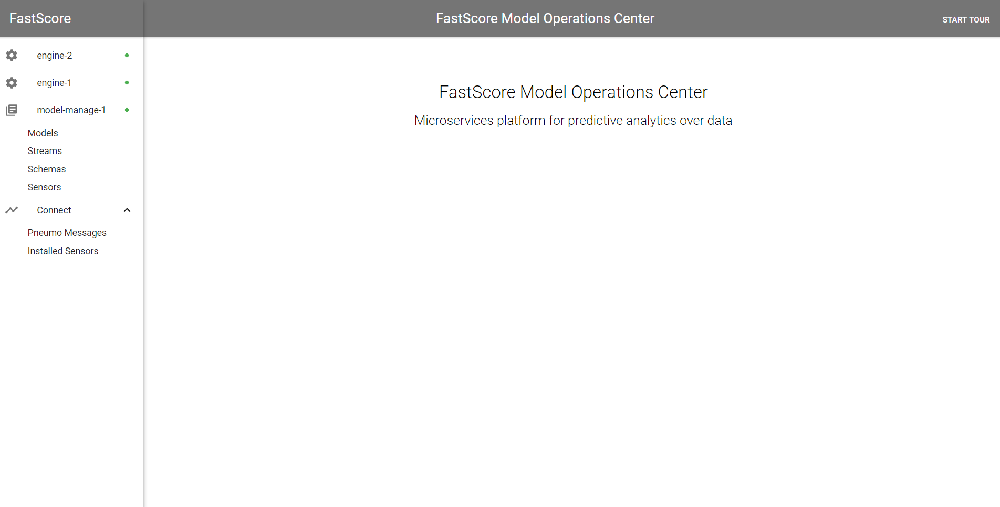
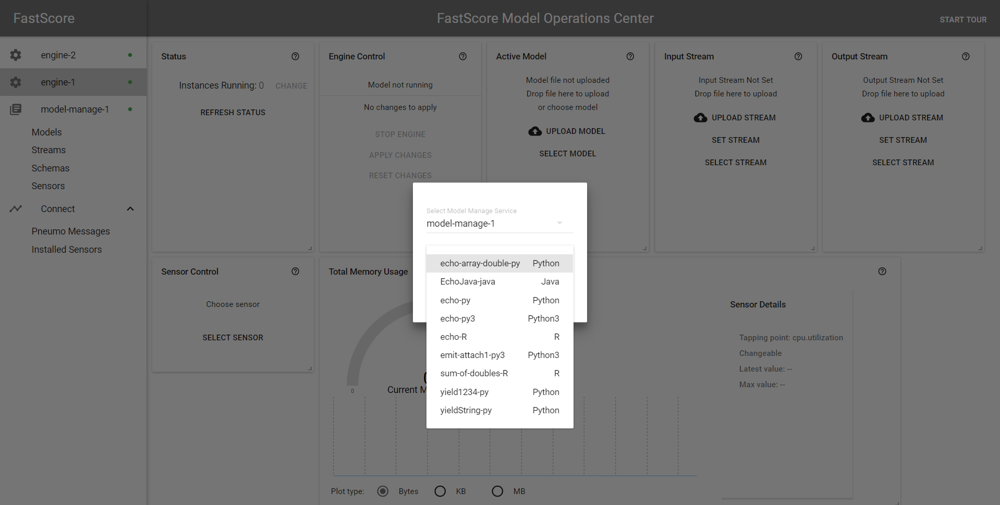
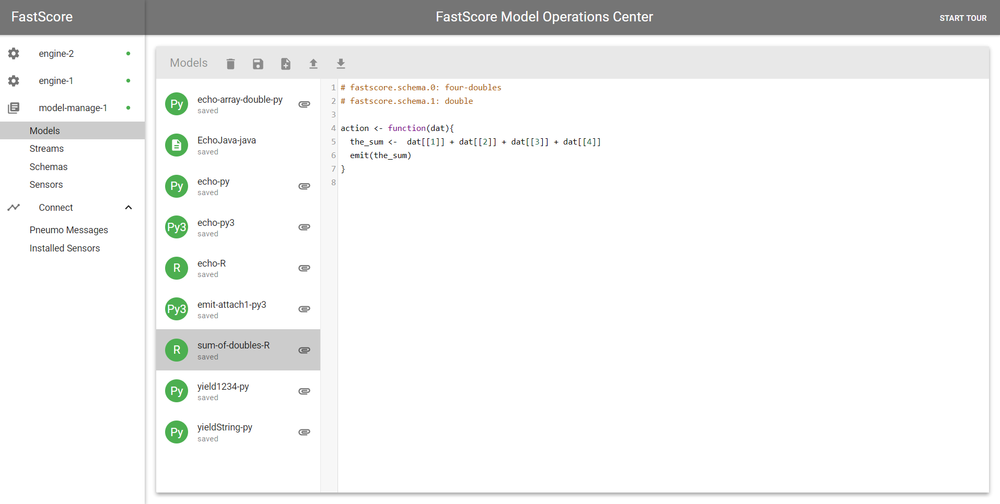
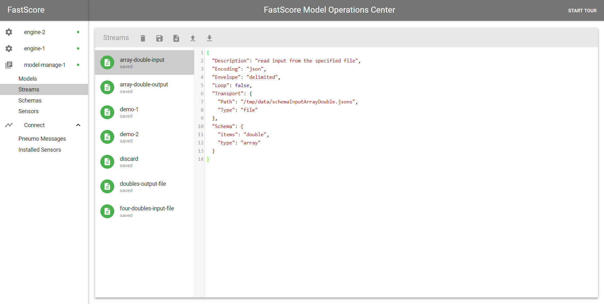

# Getting Started with ModelOp Center v1.10
This is a guide for installing and running ModelOp Center. It contains instructions for first-time and novice users, as well as reference instructions for common tasks. This guide was last updated for v1.10 of ModelOp Center.

If you need support or have questions, please email us: support@opendatagroup.com

# Contents

1. [Installing ModelOp Center](#installing-ModelOp-Center)
    1. [Prerequisites](#section-prerequisites)
    2. [Installing the ModelOp Center CLI](#installing-the-ModelOp-Center-cli)
    3. [Start ModelOp Center Microservices Suite with Docker Swarm (Recommended)](#section-start-ModelOp-Center-microservices-suite-with-docker-swarm-recommended-)
2. [Configuring and Starting ModelOp Center](#configuring-and-starting-ModelOp-Center)
3. [Using the ModelOp Center Dashboard](#section-using-the-ModelOp-Center-dashboard)
4. [Working with Models and Streams](#working-with-models-and-streams)
    1. [Creating and Loading Models](#section-creating-and-loading-assets-into-ModelOp-Center-model-manage)
    2. [Models in Python and R](#section-models-in-python-and-r)
    3. [Input and Output Schema](#section-input-and-output-schema)
    4. [Input and Output Streams](#section-input-and-output-streams)
    5. [Engine Parameters](#section-engine-parameters)
    6. [Running a Model in ModelOp Center](#section-running-a-model-in-ModelOp-Center)


## <a name="installing-ModelOp Center"></a>Installing ModelOp Center

This guide will walk you through installing and running Open Data Group's ModelOp Center microservices suite. The following instructions will generally assume that you're working on a Linux machine. There are slight differences if you're running ModelOp Center on MacOS, which will be indicated by a special note. The differences if you're running Windows have not yet been fully charted.

### <a name="section-prerequisites"></a>Prerequisites
The ModelOp Center Microservices Suite is hosted on DockerHub ([https://hub.docker.com/u/fastscore/](https://hub.docker.com/u/fastscore/)). As such, [one must first install Docker](https://docs.docker.com/engine/installation/). For example, on Ubuntu Linux:

``` bash
$ sudo apt-get install docker.io
```

It's also useful (recommended but not mandatory) to have Docker Compose installed. Installation instructions can be found here: [docs.docker.com/compose/install/](http://docs.docker.com/compose/install/).

> On MacOS, Docker actually runs inside of a virtual machine (see Docker's documentation here: [https://docs.docker.com/machine/](https://docs.docker.com/machine/) ). In order to make sure all of the ports and IP addresses are handled correctly, you'll need to run the commands from inside this virtual machine.
> To start the virtual machine and give it the name "default", use the following command:
> ``` bash
> $ docker-machine create --driver=virtualbox default
> ```
> This uses [VirtualBox](https://www.virtualbox.org) as the driver for the virtual machine. If you don't have it already, you should download the [VirtualBox client](https://www.virtualbox.org/wiki/Downloads) to manage the docker-machine. Among other things, this can be used to set up port forwarding for the virtual machine, which may be needed later.
> To switch to this environment for the default virtual machine, use the following command:
> ``` bash
> $ eval $(docker-machine env default)
> ```
> The virtual machine's IP address can be retrieved with the docker-machine ip command, e.g.,
> ``` bash
> $ docker-machine ip
> 192.168.99.100
> ```
> This IP address should be used as the ModelOp Center host machine IP address.


Once Docker has been installed, there are only a few steps needed to get ModelOp Center running.

1. Configure ModelOp Center using the ModelOp Center CLI and configuration file. 
2. Start the ModelOp Center services, either manually, or via Docker Compose (recommended).
3. Connect to the ModelOp Center Dashboard with your browser.
4. Write a ModelOp Center configuration file.

Let's go through each step carefully.

### <a name="installing-the-ModelOp-Center-cli"></a>Installing the ModelOp Center Command-Line Interface (CLI)
The ModelOp Center CLI can be downloaded here:

[Mac](https://fastscore-go-cli.s3.us-east-2.amazonaws.com/release/1.10/darwin/fastscore)
[Linux](https://fastscore-go-cli.s3.us-east-2.amazonaws.com/release/1.10/linux/fastscore)
[Windows](https://fastscore-go-cli.s3.us-east-2.amazonaws.com/release/1.10/windows/fastscore.exe)

For Mac (Darwin) and Linux make it executable:
`chmod +x fastscore`

And finally add to $Path. For Mac users, copy to `/usr/local/bin/`.

The CLI is a statically-linked binary written in Go. We also have a Python implementation of the CLI available [here](https://opendatagroup.github.io/Reference/ModelOp%20Center%20CLI/Python%20CLI).

Once you've installed the ModelOp Center CLI, check that it works by executing the following command in your terminal. Also see [ModelOp Center Command Line Interface](https://opendatagroup.github.io/Reference/ModelOp%20Center%20CLI/) for more information on the CLI commands.

``` bash
$ fastscore
NAME:
fastscore - Control FastScore from the command line.

USAGE:
fastscore [global options] command [command options] [arguments...]

VERSION:
v1.10

COMMANDS:
connect     Establish a FastScore Connection
use         Select the target engine instance
run         A shortcut for running a particular model and stream configuration
config      Configure the FastScore fleet
fleet       Examine status of the FastScore fleet
model       Manage analytic models
schema      Manage schemata
stream      Manage streams
sensor      Manage sensors
engine      Manage engines
attachment  Manage attachments
pneumo      Print pneumo messages
create      Create new FastScore services
destroy     Destroy existing FastScore services
conductor   Interact with the orchestrator
composer    Create and manage workflows
workflow    Create and manage workflows
monitor     Monitor an engine
login       Login to fastscore
debug       Watch debugging messages
stats       Get various statistics
help, h     Shows a list of commands or help for one command

GLOBAL OPTIONS:
--help, -h     show help
--version, -v  print the version

WEBSITE: http://www.opendatagroup.com
SUPPORT: support@opendatagroup.com
```

This displays a list of all of the ModelOp Center CLI commands.

### <a name="section-start-ModelOp-Center-microservices-suite-with-docker-swarm-recommended-"></a>Start ModelOp Center Microservices Suite with Docker Swarm (Recommended)

We will be referencing files from the Getting-Started github repository found [here](https://github.com/opendatagroup/Getting-Started). Use the following command to clone the repo:
`git clone https://github.com/opendatagroup/Getting-Started.git`

This set up will use Docker Swarm to bring up the ModelOp Center containers.

Items in the repo:

* README.md - descriptions of the files and instructions to deploy using ModelOp Center
* Makefile - automated setup and tear down of ModelOp Center
* docker-compose.yaml - contains a basic collection of ModelOp Center containers to deploy models
* config.yaml - configures the ModelOp Center fleet
* setup.sh - referenced in the Makefile to set up ModelOp Center
* load.sh - referenced in the Makefile to load in play models, attachments, schemas, and streams
* library/ - contains models, attachments, schemas, and streams
* data/ - contains sample data

From the directory with the Makefile, to quickly start ModelOp Center: 
```
make deploy
```

To quickly tear down ModelOp Center:
```
make stop
```

First, let's look at the containers described in the docker-compose.yaml file that are now up and running.

View all Docker containers that are running with the ```docker ps``` command. The output should look something like this:

```bash
CONTAINER ID        IMAGE                              COMMAND                  CREATED             STATUS              PORTS                                    NAMES
14bfaee9100e        fastscore/model-manage-mysql:1.9   "sh -c 'cd /var/lib/…"   About an hour ago   Up About an hour                                             fs-vanilla_database.1.vb7bticmnpauo3hz6bor4r8qx
ada9681679e8        fastscore/engine:1.10               "/fastscore/startup.…"   About an hour ago   Up About an hour                                             fs-vanilla_engine-2.1.ubonr83uuaqw2en4yk3lsc9w0
880b6882742d        fastscore/engine:1.10               "/fastscore/startup.…"   About an hour ago   Up About an hour                                             fs-vanilla_engine-1.1.or1ocif21hfoej8xxfo5qykbm
cb67e0090cf2        fastscore/connect:1.10              "bin/connect"            About an hour ago   Up About an hour                                             fs-vanilla_connect.1.wxswv0g8hojps2f2c0i5lc96l
318eedda837a        fastscore/dashboard:1.10            "npm --no-update-not…"   About an hour ago   Up About an hour                                             fs-vanilla_dashboard.1.v7ia7we8qrwpyeawkk7jzg3se
b89be509f74d        fastscore/kafka:1.9                "/entry.sh"              About an hour ago   Up About an hour    2181/tcp, 2888/tcp, 3888/tcp, 9092/tcp   fs-vanilla_kafka.1.w1tc6grz7iil56x2b8pcdbjal
84b4f75fccda        fastscore/model-manage:1.9         "bin/model_manage"       About an hour ago   Up About an hour                                             fs-vanilla_model-manage.1.o750isigzx7v17kwddn17nmzl
```

## <a name="configuring-and-starting-ModelOp-Center"></a>Configuring and Starting ModelOp Center

Next, let's take a look at the setup.sh file that is referenced in the Makefile.

``` bash
fastscore connect https://localhost:8000
fastscore config set config.yaml
fastscore fleet -wait
```

ModelOp Center will ask you to connect to the host it is running on and the port of the dashboard. In this example we are using localhost and the dashboard is listening on port 8000.

ModelOp Center's microservices architecture requires each microservice component to communicate with other components. These communications are managed by the Connect microservice. In order for Connect to connect, it has to be given information about the other microservices components in a configuration file. A sample configuration file is shown below:

``` yaml
fastscore:
  fleet:
    - api: model-manage
      host: model-manage
      port: 8002
    - api: engine
      host: engine-1
      port: 8003
    - api: engine
      host: engine-2
      port: 8003

  db:
    type: mysql
    host: database
    port: 3306
    username: root
    password: root

  pneumo:
    type: REST
    #type: kafka
    #bootstrap:
    #  - kafka:9092
    #topic: notify
```

Configuration files are written in YAML. The configuration file above specifies the host machines and ports for the Model Manage container, the MySQL database container used by Model Manage, and two Engine containers, all hosted on the same machine. Additionally, Pneumo, an asynchronous notification library used by ModelOp Center, is configured to communicate via Kafka or REST.


We can then check the status of our containers using the `fleet` command:

``` bash
$ fastscore fleet -wait
Name            API           Health
--------------  ------------  --------
engine-1        engine        ok
engine-2        engine        ok
model-manage-1  model-manage  ok
```

Finally, the load.sh file will load in some models, attachments, schemas, and streams into ModelOp Center so you can start deploying! We are loading these into the MySql backing of Model Manage for this example. Alternatively, you can connect [Model Manage to your own github repository](https://opendatagroup.github.io/Product%20Manuals/Github%20Integration/) that already has models, attachments, streams, and schemas in it!
Now we're ready to start scoring.

## <a name="section-using-the-ModelOp-Center-dashboard"></a>Using the ModelOp Center Dashboard
ModelOp Center's Dashboard provides a convenient user interface for reviewing engine status and managing models, schemas, sensors, and streams. However, as compared to the ModelOp Center CLI, it requires a few additional setup steps to get things running.

First, if you are not running ModelOp Center on your local machine (for example, if you have ModelOp Center running on a cloud service platform), you will need to allow incoming and outgoing traffic on port 8000 (used by the ModelOp Center Dashboard). You will also need to have configured ModelOp Center as described in the previous section.

To access the Dashboard, take your browser to the ModelOp Center host machine at port 8000 using the HTTPS protocol (ModelOp Center does not allow HTTP). If all goes well , you will be greeted by this screen:


*On the left-hand side of the Dashboard are four sections: engine-1, engine-2, model-manage-1, Connect. These correspond to the Engine microservices, the Model Manage microservice, and the Connect microservice. The green dots on the engines and model manage indicate that they are currently running correctly. If you have configured additional engine containers, they will also appear on the side.*

> If, instead, you get an "Application Initialization Error," check your configuration file for any errors, and verify that you have followed all of the ModelOp Center CLI configuration steps. If the `fastscore fleet` command shows both Model Manage and your Engine containers working properly, then the problem most likely has to do with Dashboard's proxy service or your host machine's network traffic settings.


## <a name="working-with-models-and-streams"></a>Working with Models and Streams

ModelOp Center leverages a set of lightweight, but powerful abstractions to allow the deployment, monitoring, and management of models across frameworks, languages, platforms, and environments. These abstractions fundamentally allow models to read in records from a data stream, score them, and output that score to another data stream. As such, running any model consists of three steps:

1. Loading models, streams, schemas, and sensors
3. Setting Engine parameters
4. Running the model

### <a name="section-creating-and-loading-assets-into-ModelOp-Center-model-manage"></a>Creating and Loading Assets into ModelOp Center Model Manage

Version 1.10 of ModelOp Center supports models in Python, R, Java, MATLAB, [PFA](http://dmg.org/pfa/), [PrettyPFA](https://github.com/opendatagroup/hadrian/wiki/PrettyPFA-Reference), H2O, PMML, and C formats. Some setup steps differ slightly between Python/R models and PFA, Java, MATLAB, or C models. As a model interchange format, PFA can provide some benefits in performance, scalability, and security relative to R and Python. PrettyPFA is a human-readable equivalent to PFA. However, as the majority of users will be more familiar with R and Python, we focus on these two languages in this section.

#### Loading Assets
The ModelOp Center CLI allows a user to load models directly from the command line. The list of models currently loaded in ModelOp Center can be viewed using the model list command:

``` bash
$ fastscore model list
Name    Type
------  ------
MyModel Python
```

Models can be added with `model add <name> <file>`, and removed with `model remove <name>`. Additionally, the `fastscore model show <name>` command will display the named model.

#### Models via the Dashboard
The Dashboard provides functionality to add and manage models. To upload a model, under the Models tab, select the "Upload model" button, and choose a model from your local machine. Alternatively, "select model", depicted below, allows you to select an existing model from the model manager by name.



Additionally, models can be added, removed, inspected, and edited from the Models tab under Model Manage:


*The screenshot above shows the model manager tab, and an existing model in ModelOp Center. Models can be removed, saved, created, uploaded, or downloaded from this view. Note that after creating or modifying a model in this view, it must still be selected for use from the Engine tab.*

### <a name="section-models-in-python-and-r"></a>Models in Python and R
All models are added to ModelOp Center and executed using the same CLI commands, namely:

``` bash
fastscore model add <modelname> <path/to/model.extension>
```

Note that, in order to determine whether a model is Python or R, Engine requires that it have an appropriate file extension (`.py` for Python, `.R` for R, `.pfa` for PFA, `.ppfa` for PrettyPFA, etc.). Also, in order to score a Python/R model, there are certain constraints on the form the model must take.

ModelOp Center includes both a Python2 and Python3 model runner. By default, `.py` files are interpreted as Python2 models---to load a Python3 model, use the file extension `.py3`, or the flag `-type:python3` option with `fastscore model add`:

``` bash
fastscore model add -type:python3 my_py3_model path/to/model.py
```


#### Python Models
There are two ways to write models to run in ModelOp Center for Python. 
<b>Style 1</b>New in the 1.10 release, we now support an additional  style of conformance to make it easier for Data Scientist to get their models ready for deployment for even more classes of models. This style is geared for models that follow a classic pattern of: (a) read data in (b) perform a prediction, and (c) write the output to a consumer. This new approach uses  `slot` objects to control the scoring behavior of the model as shown in this example below.  For a full guide, refer to this [how-to and example](https://opendatagroup.github.io/Getting%20Started/Conform%20and%20Deploy%20a%20Model/).

```python
# fastscore.action: unused

import cPickle
import FeatureTransformer
from sklearn.ensemble import GradientBoostingRegressor
from sklearn.pipeline import Pipeline

from fastscore.io import Slot

with open("gbmFit.pkl", "rb") as f:
    gbm = cPickle.load(f)
for df in Slot(0):
    Slot(1).write(gbm.predict(df))

```

<b>Style 2:</b>
An alternative approach that is well suited to a variety of REST-based paradigms is the existing 'call-back' style, which leverages `begin()` and `action()` functions controlling the prediction behavior. All Python models must declare a one-argument `action()` function. This function will be called everytime data is being score. The minimal example of a Python model is the following:

``` python
# fastscore.input: input-schema
# fastscore.output: output-schema

def action(datum):
    yield 0
```

This extremely simple model produces a 0 for every input.

In addition, we can  declare a  `begin()` function, which is called when the model is initallly deployed into the Engine and awaiting data to score. 

A slightly more sophisticated example of a Python model is the following:

``` python
# fastscore.input: input-schema
# fastscore.output: output-schema

import cPickle as pickle

def begin(): # perform any initialization needed here
        global myObject
    myObject = pickle.load(open('object.pkl'))
    pass # or do something with the unpickled object

def action(datum): # datum is expected to be of the form '{"x":5, "y":6}'
    record = datum
    x = record['x']
    y = record['y']
    yield x + y

def end():
    pass
```

This model returns the sum of two numbers. Note that we are able to import Python's standard modules, such as the `pickle` module. Non-default packages can also be added by using `#fastscore.module-attached: <module-nam>` once installed in the Engine via the Dockerfile. Custom classes and packages can be loaded using attachments, as described in the [Gradient Boosting Regressor tutorial](https://opendatagroup.github.io/Knowledge%20Center/Tutorials/Gradient%20Boosting%20Regressor/).

#### R Models
R models feature much of the same functionality as Python models, as well as the same constraint: the user must define an action function to perform the actual scoring. For example, the analogous model to the Python model above is

``` r
# fastscore.input: input-schema
# fastscore.output: output-schema

# Sample input: {"x":5.0, "y":6.0}
action <- function(datum) {
  x <- datum$x
  y <- datum$y
  emit(x + y)
}
```

### <a name="section-input-and-output-schema"></a>Input and Output Schema

ModelOp Center enforces strong typing on both the inputs and outputs of its models using [AVRO schema](http://avro.apache.org/docs/current/). For R and Python models, this typing is enforced by specifying schema names in a smart comment at the top of the model file:

``` python
# fastscore.input: array-double
# fastscore.output: double
```

Python and R models *must* specify schemas for their inputs and outputs. PrettyPFA and PFA models already contain the input and output schema as part of the model definition, so they do not require a schema attachment.

For example, a model that expects to receive records of two doubles as inputs might have the following schema:

``` json
{
  "name": "Input",
  "type": "record",
  "fields" : [
    {"name": "x", "type": "double"},
    {"name": "y", "type": "double"}
  ]
}
```

The model might then produce a stream of doubles as its output:

``` json
{
  "name": "Output",
  "type": "double"
}
```

Input and output schema must be uploaded separately to ModelOp Center. To upload the schema to ModelOp Center with the CLI, use the following commands:

``` bash
fastscore schema add input input.avsc
fastscore schema add output output.avsc
```
The 1.10 release also includes new funcitonality to automatically generate the schema from a sample data file using the `fastscore schema infer <data-file>`.  

Schemas can also be managed from within the Dashboard, using the Model Manage view.

### <a name="section-input-and-output-streams"></a>Input and Output Streams
Before a model can be run, it has to have some data to run on. Input and output streams are used to supply the incoming data to the model, and to return the corresponding scores. ModelOp Center supports a wide variety of stream transports including: file, Kafka, Authenticated Kafka, Executable, HTTP, TCP, UDP, ODBC, debug, and console streams. All of these types are configured using a Stream Descriptor file.

Stream Descriptors are small JSON files containing information about the stream. An example of a Stream Descriptor for a Kafka stream is displayed below:

``` json
{
  "Description": "read Avro-typed JSON records from a Kafka stream",
  "Transport": {
    "Type": "kafka",
    "BootstrapServers": ["127.0.0.1:9092"],
    "Topic": "data-feed-1",
    "Partition": 0
  },
  "Encoding": "json",
  "Schema": { type: "record", ... }
}
```

Stream descriptors are documented in more detail [on the stream descriptor page](https://opendatagroup.github.io/Product%20Manuals/Stream%20Descriptors/). The easiest type of stream to use is a file stream, which reads or writes records directly from/to a file inside of the ModelOp Center engine container. Here is an example of such a stream:

``` json
{
  "Description": "read input from the specified file",
  "Loop": false,
  "Transport": {
    "Type": "file",
    "Path": "/root/data/neural_net_input.jsons"
  },
  "Envelope": "delimited",
  "Encoding": "json",
  "Schema": {"type": "array", "items": "double"}
}
```

This file stream expects each line of the `neural_net_input.jsons` file to be a vector of doubles, encoded as a JSON object, and delimitated by newlines. The file is located in the `/root/data/` directory of the engine container. The `"Loop": false` line tells ModelOp Center to stop reading the file after reaching the end of the file, as opposed to looping over the lines in the file.

#### Streams via ModelOp Center CLI
The ModelOp Center CLI can be used to configure data streams. The `stream list` command displays a list of existing streams:

``` bash
$ fastscore stream list
demo-1
demo-2
```

By default, two demo file streams are included in ModelOp Center. The demo-1 data set consists of random numbers. The demo-2 dataset consists of lists of JSONS with the following AVRO schema:

``` json
{
  "type":"array",
  "items": {
    "type": "record",
    "fields": [
      {"name":"x", "type":"double"},
      {"name":"y", "type":"string"}]
  }
}
```

These demo streams can be used to test whether or not a simple model is working correctly.
Additional streams can be added using the `fastscore stream add <stream-name> <stream-descriptor-file>` command. Existing streams can be sampled (displaying the most recent items of the stream) with `fastscore stream sample <stream-name>`.

For filestreams, it is easiest to manage container input and output by linking a directory on the host machine to the engine container. This can be done in the Docker-Compose file by modifying the engine service to the following:

``` yaml
[...]

  engine-1:
    image: fastscore/engine:1.10
    network_mode: "host"
    environment:
      CONNECT_PREFIX: https://127.0.0.1:8001
    volumes:                           # new volume section
      - ./data:/root/data


[...]
```

This will link the `./data` directory on the host machine to the `/root/data` directory of the engine container. A filestream from the file "mydata.jsons" located in `data` on the host machine can then be accessed by ModelOp Center using the stream descriptor

``` json
{
  "Loop": false,
  "Transport": {
    "Type": "file",
    "Path": "/root/data/mydata.jsons"
  },
  "Envelope": "delimited",
  "Encoding": "json",
  "Schema": [...]
}
```

A similar stream descriptor can be used for the output stream to write the output scores to a file in the same directory.
> When using Docker volume linking to link a directory on the host machine to the Engine instance, Docker must have privileges to read and write from the specified directory. Additionally, the directory on the container must be chosen carefully, as its contents will be overwritten with the contents of the corresponding host directory upon linking. `/root/data` is safe (as it only contains the demo datafiles), but other directories on the container (e.g., `/usr`) may not be.


#### Streams via the Dashboard
Analogously to models, streams can also be managed from the Dashboard. Selecting the "Streams" tab under Model Manage displays the following view:


*On the left, existing Stream Descriptors are displayed. New Stream Descriptors can be added and existing ones edited from this view. The example above displays a simple file stream, which will load the `schemaInputArrayDouble.jsons` file located in the `/tmp/data/` directory of the Engine Docker container.*

### <a name="section-engine-parameters"></a>Engine Parameters
Engine parameters, such as the number of Engine instances currently running, as well as information about the model, are displayed on the Dashboard Engine tab.

### <a name="section-running-a-model-in-ModelOp-Center"></a>Running a Model in ModelOp Center
When using the Dashboard, models will begin scoring as soon as both the model and input/output streams are set from the Engine tab, and no further action from the user is required. Various statistics about performance and throughput are displayed on the Engine tab.

To run a model using the ModelOp Center CLI, use the `fastscore run` sequence of commands:
* `fastscore use engine-1` selects the Engine where we will deploy the model.
* `fastscore engine reset` refreshes the Engine to make it ready for deployment.
* `fastscore run <model-name> <input-stream-name> <output-stream-name>` runs the model named `<model-name>` with the specified input and output streams.
* `fastscore run <model-name> rest: rest:` You can also use `rest:` instead of the stream name to deploy the model with a generated REST endpoint.
* `fastscore model interact` allows you to send sample data and recieve the output back from the CLI.
* `fastscore engine stop` halts the currently running model.
* `fastscore engine inspect`  displays the status of the Engine. If the Engine is in the `ERROR` state, view the Docker Logs to view the error message. 

Some of the statistics displayed by the `fastscore job statistics` command, such as memory usage, are also shown on the Dashboard.

This concludes the ModelOp Center Getting Started guide. Now that you're familar with ModelOp Center, check out our guide on [Conforming and Deploying a Model](https://opendatagroup.github.io/Getting%20Started/Conform%20and%20Deploy%20a%20Model/) for a detailed walkthrough to help you get your model ready for deployment in ModelOp Center!

Additional ModelOp Center API documentation is available at [https://opendatagroup.github.io/Reference/FastScore%20API/](https://opendatagroup.github.io/Reference/FastScore%20API/). Happy scoring!
