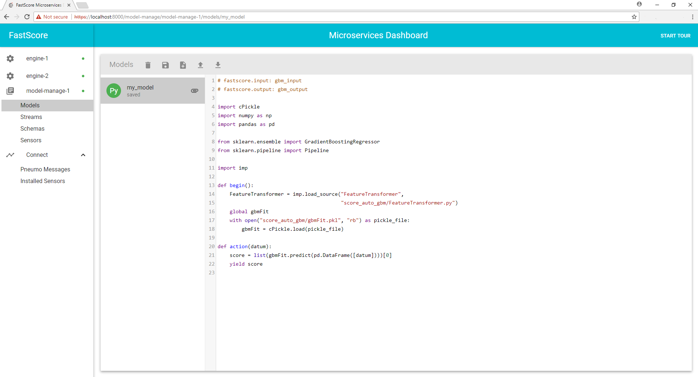

# Getting Started with FastScore v1.6.1
This is a guide for installing and running FastScore. It contains instructions for first-time and novice users, as well as reference instructions for common tasks. This guide was last updated for v1.6.1 of FastScore.

If you need support or have questions, please email us: support@opendatagroup.com

# Contents

1. [Installing FastScore](#installing-fastscore)
  
    1.1 [Prerequisites](#section-prerequisites)
    1.2 [Start FastScore Microservices Suite with Docker Compose (Recommended)](#section-start-fastscore-microservices-suite-with-docker-compose-recommended-)
    1.3 [Start FastScore Microservices Suite (Manually)](#section-start-fastscore-microservices-suite-manually-)
    1.4 [Installing the FastScore CLI](#installing-the-fastscore-cli)
2. [Configuring and Starting FastScore](#configuring-and-starting-fastscore)

    2.1 [FastScore Configuration Files](#section-fastscore-configuration-files)
    2.2 [Connecting to and Configuring FastScore with the FastScore CLI](#section-connecting-to-and-configuring-fastscore-with-the-fastscore-cli)
    2.3 [Using the FastScore Dashboard](#section-using-the-fastscore-dashboard)
3. [Working with Models and Streams](#working-with-models-and-streams)

    3.1 [Creating and Loading Models](#section-creating-and-loading-assets-into-fastscore-model-manage)
    3.2 [Models in Python and R](#section-models-in-python-and-r)
    3.3 [Input and Output Schema](#section-input-and-output-schema)
    3.4 [Input and Output Streams](#section-input-and-output-streams)
    3.5 [Engine Parameters](#section-engine-parameters)
    3.6 [Running a Model in FastScore](#section-running-a-model-in-fastscore)


## <a name="installing-fastscore"></a>Installing FastScore

This guide will walk you through installing and running Open Data Group's FastScore microservices suite. The following instructions will generally assume that you're working on a Linux machine. There are slight differences if you're running FastScore on MacOS, which will be indicated by a special note. The differences if you're running Windows have not yet been fully charted. 

### <a name="section-prerequisites"></a>Prerequisites
The FastScore Microservices Suite is hosted on DockerHub ([https://hub.docker.com/u/fastscore/](https://hub.docker.com/u/fastscore/)). As such, [one must first install Docker](https://docs.docker.com/engine/installation/). For example, on Ubuntu Linux: 

``` bash
$ sudo apt-get install docker.io
```

It's also useful (recommended but not mandatory) to have Docker Compose installed. Installation instructions can be found here: [docs.docker.com/compose/install/](http://docs.docker.com/compose/install/).

> On MacOS, Docker actually runs inside of a virtual machine (see Docker's documentation here: [https://docs.docker.com/machine/](https://docs.docker.com/machine/) ). In order to make sure all of the ports and IP addresses are handled correctly, you'll need to run the commands from inside this virtual machine.
> To start the virtual machine and give it the name "default", use the following command:
> ``` bash
> $ docker-machine create --driver=virtualbox default
> ```
> This uses [VirtualBox](https://www.virtualbox.org) as the driver for the virtual machine. If you don't have it already, you should download the [VirtualBox client](https://www.virtualbox.org/wiki/Downloads) to manage the docker-machine. Among other things, this can be used to set up port forwarding for the virtual machine, which may be needed later.
> To switch to this environment for the default virtual machine, use the following command:
> ``` bash
> $ eval $(docker-machine env default)
> ```
> The virtual machine's IP address can be retrieved with the docker-machine ip command, e.g.,
> ``` bash
> $ docker-machine ip
> 192.168.99.100
> ```
> This IP address should be used as the FastScore host machine IP address.


Once Docker has been installed, there are only a few steps needed to get FastScore running.

1. Start the FastScore services, either manually, or via Docker Compose (recommended).
2. Write a FastScore configuration file. 
3. Configure FastScore using the FastScore CLI and configuration file.  
4. Connect to the FastScore Dashboard with your browser.

Let's go through each step carefully.

### <a name="section-start-fastscore-microservices-suite-with-docker-compose-recommended-"></a>Start FastScore Microservices Suite with Docker Compose (Recommended)

Docker-Compose is a utility that streamlines the configuration and simultaneous execution of multiple Docker containers. A Docker Compose file is a YAML file defining [services](https://docs.docker.com/compose/compose-file/#service-configuration-reference), [networks](https://docs.docker.com/compose/compose-file/#network-configuration-reference) and [volumes](https://docs.docker.com/compose/compose-file/#volume-configuration-reference). The default path for a Compose file is `./docker-compose.yml`, but custom filenames are supported with the `-f <filename>` flag. The interested reader is directed to [Docker's documentation for more information on Compose files](https://docs.docker.com/compose/compose-file/). 


#### Starting and Stopping the FastScore Database
FastScore's Model Manage can use a Docker volume container as a database to store information about current models and data streams. This database can exist independently of the other FastScore microservices, which is a desirable behavior for data persistence. Start the database with the command  

``` bash
docker volume create --name=db
```

and stop it with

``` bash
docker volume rm db
```

(You may name the database whatever you wish---we use the convention `db` in this document). Note that the database should generally be running before starting any FastScore services which use the database. 

Add the database to Model Manage in the usual way for Docker volumes:

1. If using docker-compose, put the volume in the `docker-compose.yml` file(see example file below)
2. If running manually, with the `-v` flag when using `docker run`, e.g., 
    ```docker run -it -d --net=host --rm -v db:/var/lib/mysql fastscore/model-manage-mysql:1.6.1 ``` (see more below)

#### Example Docker Compose File
Below is an example Docker Compose file that will start a full suite of FastScore services with two engines:

``` yaml
version: '2'
services:
  dashboard:
    image: fastscore/dashboard:1.6.1
    network_mode: "bridge"
    ports:
      - "8000:8000"
    stdin_open: true
    tty: true
    environment:
      CONNECT_PREFIX: https://172.17.0.1:8001

  connect:
    image: fastscore/connect:1.6.1
    network_mode: "bridge"
    ports:
      - "8001:8001"
    stdin_open: true
    tty: true

  engine-1:
    image: fastscore/engine:1.6.1
    network_mode: "bridge"
    ports:
      - "8003:8003"
    stdin_open: true
    tty: true
    environment:
      CONNECT_PREFIX: https://172.17.0.1:8001

  engine-2:
    image: fastscore/engine:1.6.1
    network_mode: "bridge"
    ports:
      - "8004:8003"
    stdin_open: true
    tty: true
    environment:
      CONNECT_PREFIX: https://172.17.0.1:8001

  database:
    image: fastscore/model-manage-mysql:1.6.1
    network_mode: "bridge"
    ports:
      - "3306:3306"

  model-manage:
    image: fastscore/model-manage:1.6.1
    network_mode: "bridge"
    ports:
      - "8002:8002"
    stdin_open: true
    tty: true
    depends_on:
      - connect
      - database
    environment:
      CONNECT_PREFIX: https://172.17.0.1:8001

volumes:
  db:
  external: true
```
  
Docker Compose files can be used to initialize or halt all of the FastScore microservices components with a single command. 

For example, to start microservices using docker-compose: 

``` bash
docker-compose up -d
```

Similarly, all of the specified microservices can be stopped with the command

``` bash
docker-compose down -v
```

(Here, the `-v` flag instructs `docker-compose` to remove any lingering volumes created by the compose file. This does *not* include external Docker volumes, such as those created by `docker volume create`). 


Check that all the Docker containers are running with the ```docker ps``` command. The output should look something like this:

``` bash
CONTAINER ID        IMAGE                                COMMAND                  CREATED             STATUS              PORTS                    NAMES
51acfc33eb4e        fastscore/model-manage:1.6.1         "/bin/sh -c 'bin/mode"   15 seconds ago      Up 14 seconds       0.0.0.0:8002->8002/tcp   demos_model-manage_1
4d20a9c3c4c9        fastscore/connect:1.6.1              "/bin/sh -c 'bin/conn"   16 seconds ago      Up 14 seconds       0.0.0.0:8001->8001/tcp   demos_connect_1
432327548cef        fastscore/dashboard:1.6.1            "npm run start-fds"      16 seconds ago      Up 14 seconds       0.0.0.0:8000->8000/tcp   demos_dashboard_1
14e547577004        fastscore/model-manage-mysql:1.6.1   "/bin/sh -c '/sbin/my"   16 seconds ago      Up 14 seconds       0.0.0.0:3306->3306/tcp   demos_database_1
bf7e50c22e0a        fastscore/engine:1.6.1               "/bin/sh -c 'java -ja"   16 seconds ago      Up 14 seconds       0.0.0.0:8004->8003/tcp   demos_engine-2_1
4585ac4cf93b        fastscore/engine:1.6.1               "/bin/sh -c 'java -ja"   16 seconds ago      Up 14 seconds       0.0.0.0:8003->8003/tcp   demos_engine-1_1
```


### <a name="#section-start-fastscore-microservices-suite-manually-"></a>Start FastScore Microservices Suite (Manually)
Sometimes, whether for testing purposes or to satisfy your own hardy can-do spirit, you may want to start FastScore manually. The process is somewhat more complicated than using Docker Compose because each service must be managed individually.

To do it manually, the FastScore microservices can be installed by pulling the images from DockerHub:

``` bash
$ docker pull fastscore/model-manage:1.6.1
$ docker pull fastscore/connect:1.6.1
$ docker pull fastscore/engine:1.6.1
$ docker pull fastscore/model-manage-mysql:1.6.1
$ docker pull fastscore/dashboard:1.6.1
```

``` bash
docker run -it -d --net=host --rm fastscore/connect:1.6.1
docker run -it -d --net=host --rm -e "CONNECT_PREFIX=https://127.0.0.1:8001" fastscore/dashboard:1.6.1
docker run -it -d --net=host --rm -e "CONNECT_PREFIX=https://127.0.0.1:8001" fastscore/engine:1.6.1
docker run -it -d --net=host --rm -e "CONNECT_PREFIX=https://127.0.0.1:8001" fastscore/model-manage:1.6.1
docker run -it -d --net=host --rm -v db:/var/lib/mysql fastscore/model-manage-mysql:1.6.1
```

It is additionally useful to install the FastScore Command-Line Interface (CLI).


### <a name="#installing-the-fastscore-cli"></a>Installing the FastScore Command-Line Interface (CLI) 
The FastScore CLI can be downloaded and installed using the following commands:

``` bash
wget https://s3-us-west-1.amazonaws.com/fastscore-cli/fastscore-cli-1.6.1.tar.gz
tar xzf fastscore-cli-1.6.1.tar.gz
cd fastscore-cli-1.6.1
sudo python setup.py install
```

This will install the required dependencies. The FastScore CLI is a Python tool, so it doesn't need to be compiled, and the setup script should automatically add the CLI to `$PATH`. 


> `python-setuptools` and `python-dev` (i.e. header files) are required to properly install the FastScore CLI. These may or may not be already present on your system. If not, you will need to install them.
> For example:
> ``` bash
> $ sudo apt-get install python-setuptools
> $ sudo apt-get install python-dev
> ```


Once you've installed the FastScore CLI, check that it works by executing the following command in your terminal. Also see [FastScore Command Line Interface](https://opendatagroup.github.io/Product%20Documentation/FastScore%20Command%20Line%20Interface.html) for more information on subcommands.

``` bash
$ fastscore help
FastScore CLI v1.6.1
Usage: fastscore <command> [<subcommand> ...]
Available commands:
  help             Explain commands and options
  connect          Establish a FastScore connection
  config           Configure the FastScore fleet
  fleet            Examine status of the FastScore fleet
  use              Select the target instance
  run              Run easy model setups
  model            Manage analytic models
  attachment       Manage model attachments
  schema           Manage Avro schemas
  snapshot         Manage model snapshots
  policy           Manage import policies
  stream           Manage streams/stream descriptors
  engine           Manage engine state
  sensor           Manage sensors/sensor descriptors
  stats            Show assorted statistics
  debug            Watch debugging messages
  pneumo           Access Pneumo messages
  monitor          Monitor data processing
  Run 'fastscore help <command>' to get more details on <command> usage
```

This displays a list of all of the FastScore CLI commands. 

## <a name="configuring-and-starting-fastscore"></a>Configuring and Starting FastScore

### <a name="section-fastscore-configuration-files"></a>FastScore Configuration Files

FastScore's microservices architecture requires each microservice component to communicate with other components. These communications are managed by the Connect microservice. In order for Connect to connect, it has to be given information about the other microservices components in a configuration file. A sample configuration file is shown below:

``` yaml
fastscore:
  fleet:
    - api: model-manage
      host: 172.17.0.1
      port: 8002
    - api: engine
      host: 172.17.0.1
      port: 8003
    - api: engine
      host: 172.17.0.1
      port: 8004

  db:
    type: mysql
    host: 172.17.0.1
    port: 3306
    username: root
    password: root

  pneumo:
    type: kafka
    bootstrap:
      - 172.17.0.1:9092
    topic: notify
```

Configuration files are written in YAML. The configuration file above specifies the host machines and ports for the Model Manage container, the MySQL database container used by Model Manage, and two Engine containers, all hosted on the same machine. Additionally, Pneumo, an asynchronous notification library used by FastScore, is configured to communicate via Kafka. 

> The example file above is designed for use on a Linux machine; you will need to modify it for use in other settings (e.g. MacOS). And, as discussed above, you must create the db volume with ```docker volume create db``` (or remove the volume link from `database`)

### <a name="section-connecting-to-and-configuring-fastscore-with-the-fastscore-cli"></a>Connecting to and Configuring FastScore with the FastScore CLI
Once the FastScore suite of services is running, we have to configure Connect using the file we created earlier. 

Connect the FastScore CLI to the dashboard using the following command: 

``` bash
$ fastscore connect https://localhost:8000
```

Then, use the `config set` command to set the configuration file for Connect: 

``` bash
$ fastscore config set config.yaml
```

`config.yml` is the configuration file described [earlier in this document](#section-fastscore-configuration-files). 

We can then check the status of our containers using the `fleet` command: 

``` bash
$ fastscore fleet
Name            API           Health
--------------  ------------  --------
engine-1        engine        ok
engine-2        engine        ok
model-manage-1  model-manage  ok
```

Now we're ready to start scoring.

## Using the FastScore Dashboard
FastScore's Dashboard provides a convenient user interface for reviewing engine status and managing models, schemas, sensors, and streams. However, as compared to the FastScore CLI, it requires a few additional setup steps to get things running. 

First, if you are not running FastScore on your local machine (for example, if you have FastScore running on a cloud service platform), you will need to allow incoming and outgoing traffic on port 8000 (used by the FastScore Dashboard). You will also need to have configured FastScore as described in the previous section.

To access the Dashboard, take your browser to the FastScore host machine at port 8000. If all goes well , you will be greeted by this screen: 


*On the left-hand side of the Dashboard are four sections: engine-1, engine-2, model-manage-1, Connect. These correspond to the Engine microservices, the Model Manage microservice, and the Connect microservice. The green dots on the engines and model manage indicate that they are currently running correctly. If you have configured additional engine containers, they will also appear on the side.*

> If, instead, you get an "Application Initialization Error," check your configuration file for any errors, and verify that you have followed all of the FastScore CLI configuration steps. If the `fastscore fleet` command shows both Model Manage and your Engine containers working properly, then the problem most likely has to do with Dashboard's proxy service or your host machine's network traffic settings.


## <a name="working-with-models-and-streams"></a>Working with Models and Streams

FastScore is a streaming analytic engine: its core functionality is to read in records from a data stream, score them, and output that score to another data stream. As such, running any model consists of three steps:

1. Loading models, streams, schemas, and sensors
3. Setting Engine parameters
4. Running the model

### <a name="section-creating-and-loading-assets-into-fastscore-model-manage"></a>Creating and Loading Assets into FastScore Model Manage

Version 1.6.1 of FastScore supports models in Python, R, Java, MATLAB, [PFA](http://dmg.org/pfa/), [PrettyPFA](https://github.com/opendatagroup/hadrian/wiki/PrettyPFA-Reference) and C formats. Some setup steps differ slightly between Python/R models and PFA, Java, MATLAB, or C models. As a model interchange format, PFA can provide some benefits in performance, scalability, and security relative to R and Python. PrettyPFA is a human-readable equivalent to PFA. However, as the majority of users will be more familiar with R and Python, we focus on these two languages in this section.
 
#### Loading Assets 
The FastScore CLI allows a user to load models directly from the command line. The list of models currently loaded in FastScore can be viewed using the model list command: 

``` bash
$ fastscore model list
Name    Type
------  ------
MyModel Python
```

Models can be added with `model add <name> <file>`, and removed with `model remove <name>`. Additionally, the `fastscore model show <name>` command will display the named model. 

#### Models via the Dashboard
The Dashboard provides functionality to add and manage models. To upload a model, under the Models tab, select the "Upload model" button, and choose a model from your local machine. Alternatively, "select model", depicted below, allows you to select an existing model from the model manager by name.


Additionally, models can be added, removed, inspected, and edited from the Models tab under Model Manage:


*The screenshot above shows the model manager tab, and an existing "auto_gbm.py" model. Models can be removed, saved, created, uploaded, or downloaded from this view. Note that after creating or modifying a model in this view, it must still be selected for use from the Engine tab.*

### <a name="section-models-in-python-and-r"></a>Models in Python and R
All models are added to FastScore and executed using the same CLI commands, namely:

``` bash
fastscore model add <modelname> <path/to/model.extension>
```

Note that, in order to determine whether a model is Python or R, Engine requires that it have an appropriate file extension (`.py` for Python, `.R` for R, `.pfa` for PFA, and `.ppfa` for PrettyPFA). Also, in order to score a Python/R model, there are certain constraints on the form the model must take. 

FastScore includes both a Python2 and Python3 model runner. By default, `.py` files are interpreted as Python2 models---to load a Python3 model, use the file extension `.py3`, or the flag `-type:python3` option with `fastscore model add`:

``` bash
fastscore model add -type:python3 my_py3_model path/to/model.py
```

to add a Python3 model.

#### Python Models
Python models must declare a one-argument `action()` function. The minimal example of a Python model is the following:

``` python
# fastscore.input: input-schema
# fastscore.output: output-schema

def action(datum):
    yield 0
```

This model will produce a 0 for every input.

Additionally, Python models may declare `begin()` and `end()` functions, which are called at initialization and completion of the model, respectively. A slightly more sophisticated example of a Python model is the following:

``` python
# fastscore.input: input-schema
# fastscore.output: output-schema

import cPickle as pickle

def begin(): # perform any initialization needed here
        global myObject
    myObject = pickle.load(open('object.pkl'))
    pass # or do something with the unpickled object
    
def action(datum): # datum is expected to be of the form '{"x":5, "y":6}'
    record = datum
    x = record['x']
    y = record['y']
    yield x + y 
    
def end():
    pass
```

This model returns the sum of two numbers. Note that we are able to import Python's standard modules, such as the `pickle` module. Non-default packages can also be added using [Import Policies, as described here](https://opendatagroup.github.io/Product%20Documentation/Import%20Policies.html). Custom classes and packages can be loaded using attachments, as described in the [Gradient Boosting Regressor tutorial]().

#### R Models
R models feature much of the same functionality as Python models, as well as the same constraint: the user must define an action function to perform the actual scoring. For example, the analogous model to the Python model above is

``` r
# fastscore.input: input-schema
# fastscore.output: output-schema

# Sample input: {"x":5.0, "y":6.0}
action <- function(datum) {
  x <- datum$x
  y <- datum$y
  emit(x + y)
}
```

### <a name="section-input-and-output-schema"></a>Input and Output Schema

FastScore enforces strong typing on both the inputs and outputs of its models using [AVRO schema](http://avro.apache.org/docs/1.8.1/spec.html). For R and Python models, this typing is enforced by specifying schema names in a smart comment at the top of the model file:

``` python
# fastscore.input: array-double
# fastscore.output: double
```

Python and R models *must* specify schemas for their inputs and outputs. PrettyPFA and PFA models already contain the input and output schema as part of the model definition, so they do not require a schema attachment. 

For example, a model that expects to receive records of two doubles as inputs might have the following schema:

``` json
{
  "name": "Input",
  "type": "record",
  "fields" : [
    {"name": "x", "type": "double"},
    {"name": "y", "type": "double"}
  ]
}
```

The model might then produce a stream of doubles  as its output:

``` json
{
  "name": "Output",
  "type": "double"
}
```

Input and output schema must be uploaded separately to FastScore. To upload the schema to FastScore with the CLI, use the following commands:

``` bash
fastscore schema add input input.avsc
fastscore schema add output output.avsc
```

Attachments can also be managed from within the Dashboard, using the Model Manage view.

### <a name="section-input-and-output-streams"></a>Input and Output Streams
Before a model can be run, it has to have some data to run on. Input and output streams are used to supply the incoming data to the model, and to return the corresponding scores. Currently, ten types of stream transports are supported: file, Kafka, Authenticated Kafka, Executable, HTTP, TCP, UDP, ODBC, debug, and console streams. All of these types are configured using a Stream Descriptor file. 

Stream Descriptors are small JSON files containing information about the stream. An example of a Stream Descriptor for a Kafka stream is displayed below:

``` json
{
  "Description": "read Avro-typed JSON records from a Kafka stream",
  "Transport": {
    "Type": "kafka",
    "BootstrapServers": ["127.0.0.1:9092"],
    "Topic": "data-feed-1",
    "Partition": 0
  },
  "Encoding": "json",
  "Schema": { type: "record", ... }
}
```

Stream descriptors are documented in more detail [on the stream descriptor page](stream-descriptors). The easiest type of stream to use is a file stream, which reads or writes records directly from/to a file inside of the FastScore engine container. Here is an example of such a stream:

``` json
{
  "Description": "read input from the specified file",
  "Loop": false,
  "Transport": {
    "Type": "file",
    "Path": "/root/data/neural_net_input.jsons"
  },
  "Envelope": "delimited",
  "Encoding": "json",
  "Schema": {"type": "array", "items": "double"}
}
```

This file stream expects each line of the `neural_net_input.jsons` file to be a vector of doubles, encoded as a JSON object, and delimitated by newlines. The file is located in the `/root/data/` directory of the engine container. The `"Loop": false` line tells FastScore to stop reading the file after reaching the end of the file, as opposed to looping over the lines in the file. 

#### Streams via FastScore CLI
The FastScore CLI can be used to configure data streams. The `stream list` command displays a list of existing streams: 

``` bash
$ fastscore stream list
demo-1
demo-2
```

By default, two demo file streams are included in FastScore. The demo-1 data set consists of random numbers. The demo-2 dataset consists of lists of JSONS with the following AVRO schema:

``` json
{
  "type":"array", 
  "items": { 
    "type": "record", 
    "fields": [
      {"name":"x", "type":"double"}, 
      {"name":"y", "type":"string"}] 
  }
}
```

These demo streams can be used to test whether or not a simple model is working correctly. 
Additional streams can be added using the `fastscore stream add <stream-name> <stream-descriptor-file>` command. Existing streams can be sampled (displaying the most recent items of the stream) with `fastscore stream sample <stream-name>`. 

For filestreams, it is easiest to manage container input and output by linking a directory on the host machine to the engine container. This can be done in the Docker-Compose file by modifying the engine service to the following:

``` yaml
[...]

  engine-1:
    image: fastscore/engine:1.6.1
    network_mode: "host"
    stdin_open: true
    tty: true
    environment:
      CONNECT_PREFIX: https://127.0.0.1:8001
    volumes:                           # new volume section
      - ./data:/root/data
    
    
[...]
```

This will link the `./data` directory on the host machine to the `/root/data` directory of the engine container. A filestream from the file "mydata.jsons" located in `data` on the host machine can then be accessed by FastScore using the stream descriptor

``` json
{
  "Loop": false,
  "Transport": {
    "Type": "file",
    "Path": "/root/data/mydata.jsons"
  },
  "Envelope": "delimited",
  "Encoding": "json",
  "Schema": [...]
}
```

A similar stream descriptor can be used for the output stream to write the output scores to a file in the same directory. 
> When using Docker volume linking to link a directory on the host machine to the Engine instance, Docker must have privileges to read and write from the specified directory. Additionally, the directory on the container must be chosen carefully, as its contents will be overwritten with the contents of the corresponding host directory upon linking. `/root/data` is safe (as it only contains the demo datafiles), but other directories on the container (e.g., `/usr`) may not be.


#### Streams via the Dashboard
Analogously to models, streams can also be manipulated from the Dashboard. Selecting the "Streams" tab under Model Manage displays the following view:


*On the left, existing Stream Descriptors are displayed. New Stream Descriptors can be added and existing ones edited from this view. The example above displays a simple file stream, which will load the `input_data.jsons` file located in the `/root/data directory` of the Engine Docker container.*

### <a name="section-engine-parameters"></a>Engine Parameters
Engine parameters, such as the number of Engine instances currently running, as well as information about the model, are displayed on the Dashboard Engine tab.

### <a name="section-running-a-model-in-fastscore"></a>Running a Model in FastScore
When using the Dashboard, models will begin scoring as soon as both the model and input/output streams are set from the Engine tab, and no further action from the user is required. Various statistics about performance and memory usage are displayed on the Engine tab.
To run a model using the FastScore CLI, use the `fastscore job` sequence of commands:

  * `fastscore job run <model-name> <input-stream-name> <output-stream-name>` runs the model named `<model-name>` with the specified input and output streams.
  * `fastscore job stop` halts the currently running model. 
  * `fastscore job status` and `fastscore job statistics` display various information about the currently running job.
Some of the statistics displayed by the `fastscore job statistics` command, such as memory usage, are also shown on the Dashboard.

This concludes the FastScore Getting Started guide. Additional FastScore API documentation is available at [https://opendatagroup.github.io/API/](https://opendatagroup.github.io/API/). Happy scoring!