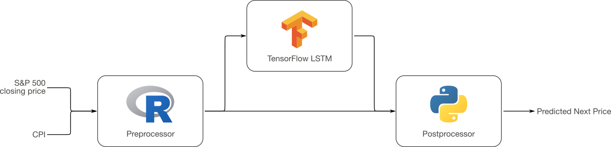
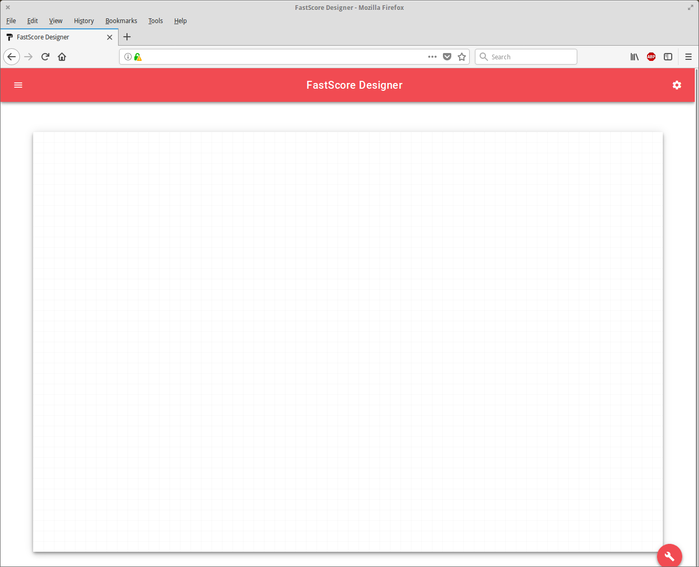
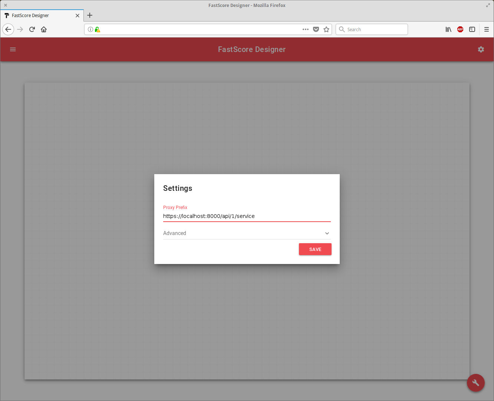
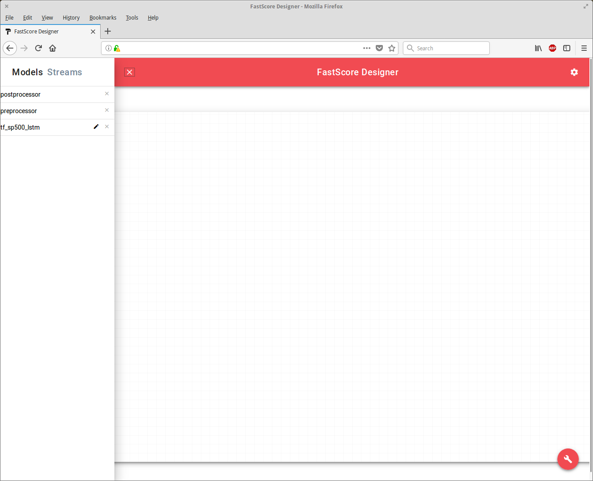
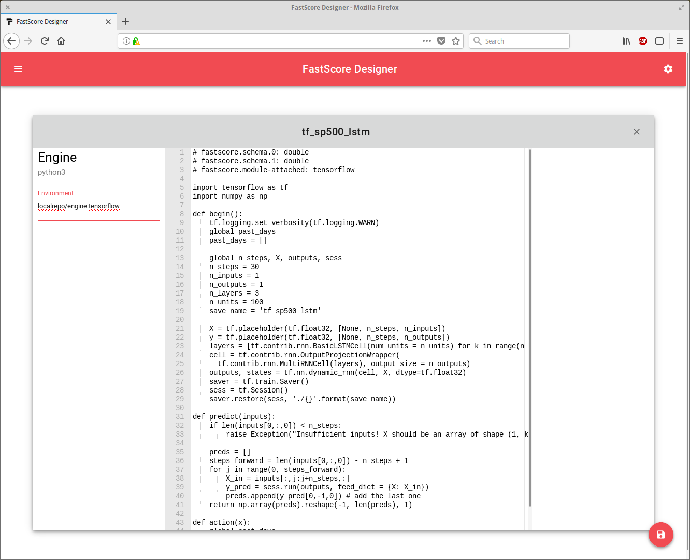
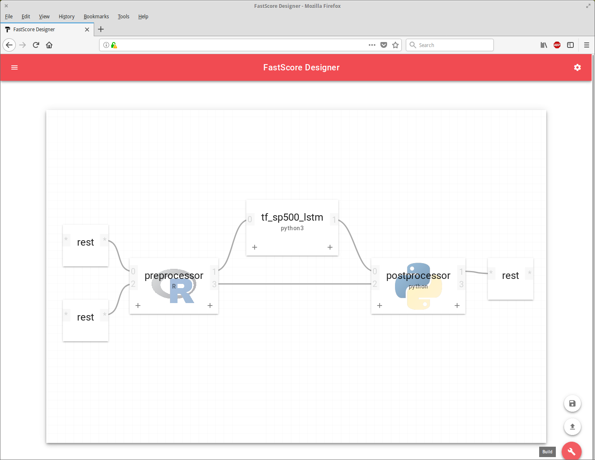

<script src="https://cdn.mathjax.org/mathjax/latest/MathJax.js?config=TeX-AMS-MML_HTMLorMML" type="text/javascript"></script>

# Deploy a Workflow with Composer

> **WARNING:**
>
> Composer is an experimental component in ModelOp Center v1.7, and features may be
> subject to change.

In this example, we'll use ModelOp Center Composer to deploy a multi-model workflow.
We'll re-use the LSTM model [from the TensorFlow example](../Tensorflow LSTM),
and add some extra model stages to do pre- and post-processing of the data for
this model. We'll be using a mixture of Python 3 and R for our models.

ModelOp Center Composer is a tool for building and deploying analytic workflows in
ModelOp Center. Recall that the LSTM model predicts a CPI-normalized, adjusted
S&P closing price based on the previous 30 days' closing prices. By using Composer,
we'll take in the raw S&P closing prices and consumer price index (CPI) data,
produce normalized input for the LSTM model, and then transform the model's output
back to actual S&P 500 prices. This analytic workflow is depicted below:



<p align="center"><i>Analytic Workflow</i></p>

The daily S&P 500 closing prices since June 1, 2007, as well as the corresponding
CPI data, [can be obtained here](https://s3-us-west-1.amazonaws.com/ModelOp Center-examples/tf_composer_files.tar.gz).

## Contents

1. [The Preprocessor](#the-preprocessor)
2. [The Postprocessor](#the-postprocessor)
3. [Setting up Composer](#setting-up-composer)
4. [Creating the Workflow in Designer](#creating-the-workflow-in-designer)
5. [Deploy and execute the Workflow](#deploy-and-execute-the-workflow)

## The Preprocessor

The preprocessor model accepts data from two different sources (S&P 500 closing
prices, and CPI), and uses that data to produce the transformed inputs that the
TensorFlow LSTM model needs to make its predictions. Recall that this transformation
consists of two steps:

1. The S&P 500 closing price is divided by the CPI, and then
2. The predicted linear trend is subtracted from this number.

Mathematically, we can write this as:

$$ \tilde{s}(t) = \frac{s(t)}{c(t)} - mt - b, $$

where $$s(t)$$ is the S&P 500 closing price on day $$t$$, $$c(t)$$ the CPI on day $$t$$,
$$m$$ and $$b$$ are the slope and intercept of the linear trend described in the
[TensorFlow LSTM tutorial](../Tensorflow LSTM), and $$\tilde{s}$$ is the input to the LSTM model.

Let's implement our preprocessing step using R. First, we'll define two functions:

```R
rescale <- function(close, cpi){
    close/cpi
}

reg <- function(date){
    slope*date + intercept
}
```

These functions will make our feature transformation expression a little cleaner.
If `date`, `sp500`, and `cpi` represent the date, S&P 500 closing price, and CPI,
respectively, then calculating the adjusted input is easy:

```R
rescale(sp500, cpi) - reg(date)
```

To prepare this preprocessor for ModelOp Center, we'll need to write an R script that
can accept asynchronous, heterogeneous inputs from two input streams. Fortunately,
ModelOp Center provides abstractions for multiple streams that make this easy. When
defining an `action` function, just include the `slot` argument in the function
signature, and then ModelOp Center will automatically supply the slot number (a numeric
identifier of the input stream) along with the input data:

```R
action <- function(data, slot) {
    [...]
}
```

Because our model may receive S&P 500 and CPI data asynchronously, but our
calculation depends on having both the S&P 500 price and CPI available in order
to perform the calculation, let's create two lists to keep track of the data
received thus far from each of these sources. This can be done in the `begin`
function:

```R
begin <- function(){
    slope <<- 0.0002319547958991928
    intercept <<- 0.4380634632578033

    cpis <<- list()
    sp500s <<- list()
}
```

(Note that we've also initialized the `slope` and `intercept` global variables
here).

In our action function, we'll first append items to these lists depending on
what slot they came in on, and then pop them from the list when both lists
have elements available:

```R
action <- function(data, slot){

    if(slot == 0){ # SP500 input
        count <- length(sp500s)
        sp500s[[count + 1]] <<- data
    }

    if(slot == 2){ # CPI input
        count <- length(cpis)
        cpis[[count + 1]] <<- data
    }

    while(length(sp500s) > 0 && length(cpis) > 0){
        sp500 <- sp500s[[1]]
        sp500s[[1]] <<- NULL # pop from the front of the list
        cpi <- cpis[[1]]
        cpis[[1]] <<- NULL # pop from the front of the list

        [...] # Do something
    }
}
```

Thus far we haven't given much thought to the schemata used by this preprocessor.
Let's take a moment to address that now. In this example, let's assume the CPI
data looks like JSON-encoded records with two fields (date and value). Some
example inputs might be:

```
{"Date": 20968.0, "CPI": 207.234}
{"Date": 20971.0, "CPI": 207.244}
{"Date": 20972.0, "CPI": 207.254}
{"Date": 20973.0, "CPI": 207.2642}
```

ModelOp Center uses an Avro schema system to enforce strong typing on models' inputs
and outputs. The Avro schema for this data is:

```json
{
    "name":"cpi",
    "type":"record",
    "fields":[
        {"name": "Date", "type":"double"},
        {"name": "CPI", "type": "double"}
    ]
}
```

The S&P 500 inputs will similarly be JSON records:
```
{"Date": 20968.0, "Close": 1536.339966}
{"Date": 20971.0, "Close": 1539.180054}
{"Date": 20972.0, "Close": 1530.949951}
{"Date": 20973.0, "Close": 1517.380005}
```
with Avro schema:
```json
{
    "name":"sp500",
    "type":"record",
    "fields":[
        {"name": "Date", "type":"double"},
        {"name": "Close", "type": "double"}
    ]
}
```

When deserializing data into R objects, ModelOp Center encodes these records as
lists with named indices. So, for example, the element
```
{"Date": 20968.0, "CPI": 207.234}
```
becomes to the R object
```R
list("Date"=20968.0, "CPI"=207.234)
```

In ModelOp Center R, the `emitTo` function can be used to direct output to a particular
slot in the engine. So, filling out the `action` function above, we have:

```R
action <- function(data, slot){
    if(slot == 0){ # SP500 input
        count <- length(sp500s)
        sp500s[[count + 1]] <<- data
    }
    if(slot == 2){ # CPI input
        count <- length(cpis)
        cpis[[count + 1]] <<- data
    }

    while(length(sp500s) > 0 && length(cpis) > 0){
        sp500 <- sp500s[[1]]
        sp500s[[1]] <<- NULL # pop from the front of the list
        cpi <- cpis[[1]]
        cpis[[1]] <<- NULL

        date <- sp500[['Date']] # Assume inputs in both streams are ordered
        lin_reg = reg(date)
        adjusted_price <- rescale(sp500[['Close']], cpi[['CPI']]) - lin_reg

        lin_reg_plus_one = reg(date + 1) # what to remove from the output
        adjustment <- list("LR"=lin_reg_plus_one, "CPI"=cpi[['CPI']])

        emitTo(1, adjusted_price)
        emitTo(3, adjustment)
    }
}
```


Putting it all together, here is our ModelOp Center-ready preprocessor R script:

**preprocessor.R**
```R
# ModelOp Center.schema.0: sp500
# ModelOp Center.schema.2: cpi
# ModelOp Center.schema.1: double
# ModelOp Center.schema.3: adjustment

begin <- function(){
    slope <<- 0.0002319547958991928
    intercept <<- 0.4380634632578033

    cpis <<- list()
    sp500s <<- list()
}

action <- function(data, slot){
    if(slot == 0){ # SP500 input
        count <- length(sp500s)
        sp500s[[count + 1]] <<- data
    }
    if(slot == 2){ # CPI input
        count <- length(cpis)
        cpis[[count + 1]] <<- data
    }

    while(length(sp500s) > 0 && length(cpis) > 0){
        sp500 <- sp500s[[1]]
        sp500s[[1]] <<- NULL # pop from the front of the list
        cpi <- cpis[[1]]
        cpis[[1]] <<- NULL

        date <- sp500[['Date']] # Assume inputs in both streams are ordered
        lin_reg = reg(date)
        adjusted_price <- rescale(sp500[['Close']], cpi[['CPI']]) - lin_reg

        lin_reg_plus_one = reg(date + 1) # what to remove from the output
        adjustment <- list("LR"=lin_reg_plus_one, "CPI"=cpi[['CPI']])

        emitTo(1, adjusted_price)
        emitTo(3, adjustment)
    }
}

rescale <- function(close, cpi){
    close/cpi
}

reg <- function(date){
    slope*date + intercept
}
```

## The Postprocessor

Just as we had to apply some data transformations on the inputs to the TensorFlow
model using a preprocessor script, we also have to reverse these transformations
to extract actual S&P 500 price predictions from the TensorFlow model. Let's write
the postprocessor script in Python.

The postprocessor model will take in the "adjustment" output produced by the
preprocessor model (which includes the CPI and linear regression data) along with
the predictions produced by the LSTM model. To turn these predictions into
S&P 500 closing prices, we need to add back the linear contribution, and then
multiply the result by the CPI. Denoting the "adjustment" record obtained from
the preprocessor's output by `adjust`, and the LSTM prediction by `pred`, the
dollar-valued S&P 500 closing price prediction is

```python
lr = adjust['LR']
cpi = adjust['CPI']

return cpi*(pred + lr)
```

However, we're not done yet---our postprocessing script has two additional
considerations:

1. We need to make sure that we're applying our adjustments to the LSTM predictions
  for the right date.
2. The LSTM model will not produce any output for the first 30 inputs received,
  while the preprocessor model produces output for every input. (Recall that
  the LSTM model predicts the next day's closing price based on the previous
  30 days' closing prices.)

To address the first issue, we can use the same buffering technique we used
in the preprocessor model. For the second issue, we can simply ignore the first
30 adjustments produced by the preprocessor model. In total, the postprocessing
script is:

**postprocessor.py**
```python
# ModelOp Center.schema.0: double
# ModelOp Center.schema.2: adjustment
# ModelOp Center.schema.1: double

def begin():
    global adjustments, predictions, input_count, input_threshold
    adjustments = []
    predictions = []
    input_count = 0
    input_threshold = 30

def action(data, slot):
    global adjustments, predictions, input_count, input_threshold
    input_count += 1

    if slot == 0:
        predictions.append(data)
    if slot == 2 and input_count >= input_threshold:
        adjustments.append(data)

    while len(adjustments) > 0 and len(predictions) > 0:
        adjust = adjustments[0]
        pred = predictions[0]
        adjustments = adjustments[1:]
        predictions = predictions[1:]

        lr = adjust['LR']
        cpi = adjust['CPI']

        yield cpi*(pred + lr)
```


## Setting up Composer

ModelOp Center Composer is an experimental tool for streamlining the creation and
deployment of large, complex analytic workflows. In this example, we have a
comparatively simple workflow, which serves as a good introduction to Composer's
functionality.

If you're not interested in manually creating and deploying Composer, feel free
to skip ahead to the next section---you can
[download an automation script to perform all configuration here](https://s3-us-west-1.amazonaws.com/ModelOp Center-examples/tf_composer_files.tar.gz).

It's easy to deploy ModelOp Center Composer using Docker Compose or Docker Swarm. For
this example, we'll use Swarm. Docker Swarm uses the same YAML definition files
as Docker Compose, so you can re-use the example Docker Compose file from the
[Getting Started Guide](https://opendatagroup.github.io/Getting%20Started/Getting%20Started%20with%20ModelOp Center/) or
download [all the files needed for this step here](https://s3-us-west-1.amazonaws.com/ModelOp Center-examples/tf_composer_files.tar.gz).

Composer consists of three microservices: Designer (a web GUI), Composer (the
core component), and Conductor (for interactions with the container orchestration
layer). To define these services, add the following service definitions to the
Compose file:

```yaml
conductor:
  image: ModelOp Center/conductor-docker:dev
  ports:
    - "8080:8080"
  volumes:
    - "/var/run/docker.sock:/var/run/docker.sock"
  networks:
    - fsnet
  environment:
    MODE: swarm
    NETWORK: ModelOp Center_fsnet

composer:
  image: ModelOp Center/composer:dev
  depends_on:
    - proxy
    - connect
    - conductor
  ports:
    - "8010:8010"
  networks:
    - fsnet
  environment:
    CONDUCTOR_HOST: https://conductor:8080
    PROXY: https://proxy:8000
    MODE: Kafka
    KAFKA_SERVERS: kafka:9092

designer:
  image: ModelOp Center/designer:dev
  ports:
    - "8012:8012"
  networks:
    - fsnet
```

Note that we are deploying all of our services in a custom named network ("fsnet"),
and that Conductor requires access to the Docker socket on the host machine (
this is needed to interact with and spawn other containers). Additionally,
in place of the ModelOp Center Dashboard, we'll use the lightweight "frontman" proxy:

```yaml
proxy:
  image: ModelOp Center/frontman:dev
  ports:
    - "8000:8000"
  environment:
    CONNECT_PREFIX: https://connect:8001
  networks:
    - fsnet
```

With the docker-compose YAML file updated, let's deploy the services using
Docker Swarm:

```
docker swarm init
docker stack deploy -c docker-compose.yaml ModelOp Center
```

Once deployed, configure the fleet and add all of the assets to Model Manage.
For example, using the CLI:

```
ModelOp Center connect https://localhost:8000 # fleet proxy
ModelOp Center config set config.yaml
ModelOp Center fleet -wait

# Add models
ModelOp Center model add -type:python3 tf_sp500_lstm tf_sp500_lstm.py
ModelOp Center attachment upload tf_sp500_lstm attachment.tar.gz

ModelOp Center model add preprocessor preprocessor.R
ModelOp Center model add postprocessor postprocessor.py

# Add streams
ModelOp Center stream add rest rest.json

# Add schemas
ModelOp Center schema add double double.avsc
ModelOp Center schema add cpi cpi.avsc
ModelOp Center schema add sp500 sp500.avsc
ModelOp Center schema add adjustment adjustment.avsc
```

No special configuration commands are necessary for Composer---all relevant settings
can be controlled via container environment variables.

## Creating the Workflow in Designer

With the ModelOp Center fleet started and Composer and Designer ready to run, open your
browser and navigate to the Designer URL (for example, `https://localhost:8012`).
You may have to add a browser security exception for Designer because, like other
components in the ModelOp Center fleet, Designer uses self-signed certificates by default.

Upon accessing Designer, you should see the following display:



The Designer interface consists of a canvas and three menu icons (in the corners
of the screen). First, we'll use the upper-right gear icon to set some configuration
options. Click on this icon, and enter the URL of the ModelOp Center fleet proxy
relative to your browser:



For example, if you can access Designer at `https://localhost:8012`, and you are
using [the supplied Docker Compose file](https://s3-us-west-1.amazonaws.com/ModelOp Center-examples/tf_composer_files.tar.gz), the proxy prefix is
`https://localhost:8000/api/1/service`.

If you have not entered a valid proxy prefix, or Designer is otherwise unable to
connect to the rest of the fleet, an error message will be displayed.

After configuring Designer, let's start building our workflow. Click on the menu
icon in the upper-left corner to display a list of all available stream and model
assets for this project.



If you mouse over an asset's name, an edit icon will appear. This displays the
asset's source code, and, for models, lets you set other execution options
(such as the model environment).



The TensorFlow LSTM model requires a model environment that contains TensorFlow.
Fortunately, in [the TensorFlow tutorial](../Tensorflow LSTM/), we have already
created a custom ModelOp Center engine image with tag `localrepo/engine:tensorflow`.
Set the model to use this environment, and click the save icon to save changes.

With our assets configured and Designer connected to Composer and the rest of the
ModelOp Center fleet, we're ready to start making our analytic workflow. To build a
workflow, just drag and drop assets onto the canvas. Click the "+" button on
a workflow node to increase the number of possible connections for that node, and
drag a line between two nodes to connect them. Our workflow should look something
like this:



Note that we have attached REST streams to the inputs of the preprocessor model
and the output of the postprocessor model---this exposes our Workflow as an
on-demand RESTful service.

Once the workflow is designed, click on the wrench icon to either save the workflow,
or deploy it. Workflows are saved as human-readable YAML documents that describe
the connections between each component. For example, the YAML corresponding to
the workflow just created is:

```yaml
---
Assets:
    Models:
    - Name: tf_sp500_lstm
      Environment: localrepo/engine:tensorflow
    - Name: preprocessor
    - Name: postprocessor
    Streams:
    - Name: rest

Workflow:
    preprocessor:
        Inputs:
            0: rest
            2: rest
        Outputs:
            1: tf_sp500_lstm
            3: postprocessor

    tf_sp500_lstm:
        Inputs:
            0: preprocessor
        Outputs:
            1: postprocessor

    postprocessor:
        Inputs:
            0: tf_sp500_lstm
            2: preprocessor
        Outputs:
            1: rest

```

Once a workflow YAML has been created, it can be saved and loaded later into
Designer, or deployed directly to Composer via Composer's REST API.

For now, let's click the "build" button, give our workflow a name, and deploy it.

## Deploy and execute the Workflow

Upon clicking "build" in Designer, the workflow will be passed to Composer, ModelOp Center
engines will be spawned to handle any models in the workflow, and Composer will
deploy models to the spawned engines and create internal stream connections to
handle inter-engine data streams. (By default, Kafka streams are created, but
other formats are also supported.)

Deployment may take a minute or two as new engine containers are created and
configured. Once the models are deployed, there are a number of different ways
of delivering data to the workflow.

One of the easiest is using the ModelOp Center CLI:

To target the CLI at a specific engine, use the `ModelOp Center use` command. For example:
```
ModelOp Center use engine-2
```
Then, to determine the model active on this engine, enter the command
```
ModelOp Center model inspect
```

This information can also be obtained from the Dashboard. For the purposes of this
demo, let's assume that the preprocessor model is deployed on `engine-3`, and
the postprocessor model is depoyed on `engine-1`. Let's first watch the outputs
from `engine-1`: in a terminal window, enter the commands
```
ModelOp Center use engine-1
ModelOp Center model output -c
```
This will print any REST output produced by the postprocessor model directly to
the command line.

Next, in another terminal window, enter the command
```
ModelOp Center use engine-3
```
to switch the context back to `engine-3`. We'll use the `ModelOp Center model input`
command to supply data to the preprocessor model.
Use the `ModelOp Center model input 0` command to enter data in input slot 0
(recall that this is the S&P 500 closing prices).
Let's enter in the first 35 days of closing prices:
```
head -35 close_prices.jsons | ModelOp Center model input 0
```
And then, the first 35 days of CPI data:
```
head -35 cpi.jsons | fastcore model input 2
```
Note that we're piping the inputs to slot 2 of the model, since this is the
CPI data.

With luck, you'll see the model's predictions for days 31 through 35 printed to
the first terminal window:
```
$ ModelOp Center model output -c
1554.22092567
1552.505235
1553.07839698
1549.9272212
1557.06023473
```

For comparison, the observed S&P 500 closing prices for days 31 through 35 are
1549.52, 1549.37, 1546.17, 1553.08, and 1534.10, so our model's predictions were
accurate to within 2% of the actual closing prices. Not bad!
