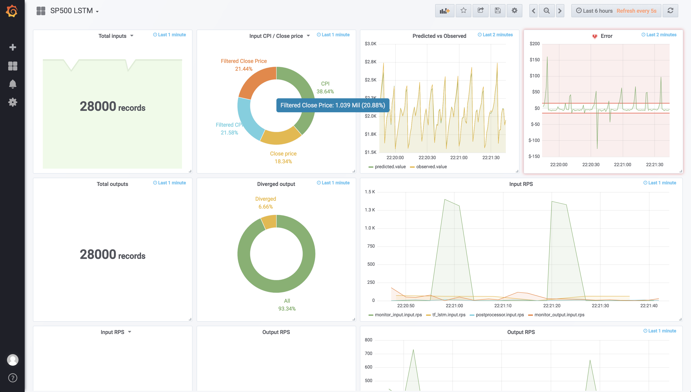

# Monitoring an Analytic Workflow with Grafana



In this tutorial, we'll instrument a workflow to collect various runtime metrics, then visualize them in Grafana. For a more detailed look at the model used here, see [Tensorflow LSTM](../Tensorflow LSTM/).

## Contents

1. [Important areas for monitoring](#important-areas-for-monitoring)
2. [Collecting sensor data](#collecting-sensor-data)
3. [Monitoring models](#monitoring-models)
4. [Grafana visualization](#grafana-visualization)

## Important areas for monitoring

Any production-ready analytic deployment has to make sure to monitor the following key areas:

* The Model
	* How is the model performing? Does it need to be retrained?
	* Is it coping with the workload? Does it need to be scaled out?

* The Data
	* Is my input data changing? How noisy is it?
	* How fast is it coming in/out? What’s the latency?

* The Infrastructure
	* Are all my compute nodes/engines healthy?
	* What does the CPU/Memory load look like?

Some of this data can be collected using [ModelOp Center Sensors](../../../Archived/Product Documentation/Sensors), while other, more discrete metrics, such as model drift or noise level has to be computed using what we call [Monitoring Models](#monitoring-models).

## Collecting sensor data

First, a brief introduction to ModelOp Center Sensors. A sensor is a configurable function that collects data from a particular point in the model execution pipeline (a tapping point) according to some activation schedule. It is configured using a JSON specification (Sensor Descriptor) and can be installed/uninstalled into a running Engine.

For a deeper dive, see [ModelOp Center Sensors](../../../Archived/Product Documentation/Sensors)

We will extract the following metrics from sensor data:

* [Input/Output throughput to all models](#throughput) (Records per second)
* [Number of records consumed/produced](#record-count)
* [Number of records rejected by schema/encoding](#rejected-records)
* [Engine health status](#health-status)
* [CPU/Memory usage](#cpu-memory-usage)

We will be attaching a model to the sensor report stream ([Pneumo](#another-dead-link)), filtering out and processing the metrics we need from there. Let’s look at an example of a sensor report we are going to encounter:

```json
{
    "type": "sensor-report",
    "timestamp": "2018-03-05T17:52:45.664600Z",
    "tap": "manifold.0.records.rejected.by.schema",
    "src": "05964876-aa92-4a93-b040-faa6abb817f3",
    "id": 7,
    "delta_time": 1.396,
    "data": 5
}
```

The key fields to notice here are `tap`, `src` and `data`. The `tap` field tells us which tapping point the report it coming from, the `src` field tells us the UUID of the engine and the `data` field shows us the value (singular or accumulated).

Since all sensor reports go into a single topic, we will use the `src` field to differentiate reports from different engines. In order to make our metrics less cryptic, let’s change the engine UUID into the name of the model running on that engine. We can do so using the SDK, like so:

```python
from ModelOp Center.suite import Connect, Engine

connect = Connect(PROXY_PREFIX)
fleet = connect.fleet()

SRC_TO_MODEL = {}
for f in fleet:
	if f['api'] == 'engine':
		engine = Engine(f['name'])
		SRC_TO_MODEL[f['src']] = engine.active_model.name
```

Since we are using Composer to deploy our workflow, the same can be done using the `/1/workflow/NAME/status` call, like so:

```python
import requests
import json

status = json.loads(requests.get('https://COMPOSER_HOST/1/workflow/NAME/status', verify=False).text)

SRC_TO_MODEL = {}
for model in status:
	SRC_TO_MODEL[status[model]['Engine']['ID']] = model
```

### Record Count

The number of records consumed/produced is reported by the `manifold.N.records.count` sensor, where N is the slot number (see [Multiple Input/Output streams](../../../Product Manuals/Multiple Input and Output Streams/)). Here's what consuming data from this sensor would look like:

```python
# ModelOp Center.schema.0: sensor-report
# ModelOp Center.schema.1: tagged-double

import re

record_count = re.compile('manifold.([0-9]+).records.count')

def action(datum):
	
	# Find model name (See SRC_TO_MODEL above)
	model = find_model(datum['src'])

	if record_count.match(datum['tap']):
		slotno = record_count.match(datum['tap']).group(1)
		yield (1, make_record('{}.{}.record.count'.format(model, slotno), datum['data']))

```

### Rejected records

Similarly, rejected record counts can be consumed from the `manifold.N.records.rejected.by.schema` for records rejected by schema and `manifold.N.records.rejected.by.encoding` for records rejected by encoding.

```python
# ModelOp Center.schema.0: sensor-report
# ModelOp Center.schema.1: tagged-double

import re

rejected_schema_count = re.compile('manifold.([0-9]+).records.rejected.by.schema')
rejected_encoding_count = re.compile('manifold.([0-9]+).records.rejected.by.encoding')

def action(datum):
	
	# Find model name (See SRC_TO_MODEL above)
	model = find_model(datum['src'])

	if rejected_schema_count.match(datum['tap']):
		slotno = rejected_schema_count.match(datum['tap']).group(1)
		yield (1, make_record('{}.{}.record.rejected.by.schema.count'.format(model, slotno), datum['data']))
	elif rejected_encoding_count.match(datum['tap']):
		slotno = rejected_encoding_count.match(datum['tap']).group(1)
		yield (1, make_record('{}.{}.record.rejected.by.encoding.count'.format(model, slotno), datum['data']))
```

### CPU Memory Usage

CPU/Memory utilization is reported by the `sys.cpu.utilization` and `sys.memory` respectively. To consume these reports, simply extract the `data` field:

```python
# ModelOp Center.schema.0: sensor-report
# ModelOp Center.schema.1: tagged-double

def action(datum):
	
	# Find model name (See SRC_TO_MODEL above)
	model = find_model(datum['src'])

	if datum['tap'] == 'sys.cpu.utilization':
		yield (1, make_record('{}.cpu.utilization'.format(model), datum['data']))
	elif datum['tap'] == 'sys.memory':
		yield (1, make_record('{}.memory'.format(model), datum['data']))
``` 

### Throughput

Computing throughput is a bit more involved. We will use the data reported by the `manifold.N.records.count` sensor along with the `delta_time` field, which tells us how much time has passed since the last report, to compute the throughput. Since `delta_time` might be zero, we will need to accumulate data fields until a non-zero `delta_time` is seen. It's important to remember to have a separate buffer for each model and slot number so different sensor reports don't interfere with each other.

```python
# ModelOp Center.schema.0: sensor-report
# ModelOp Center.schema.1: tagged-double

import re

record_count = re.compile('manifold.([0-9]+).records.count')
BUFFER = {}


def action(datum):
    global BUFFER

    # Find model name (See SRC_TO_MODEL above)
    model = find_model(datum['src'])

    if record_count.match(datum['tap']):
        slotno = record_count.match(datum['tap']).group(1)

        try:
            old_n = BUFFER['{}.{}.count'.format(model, slotno)]

            delta_n = old_n - datum['data']

            if datum['delta_time'] != 0:
                try:
                    prev_delta_t = BUFFER['{}.{}.delta'.format(model, slotno)]

                    throughput = float(abs(delta_n / prev_delta_t))

                    yield (1, make_record('{}.{}.rps'.format(model, slotno), throughput))
                except KeyError:
                    pass
                # Accumulate delta_time till next non-zero delta_time
                BUFFER['{}.{}.delta'.format(
                    model, slotno)] = datum['delta_time']
            else:
                # Accumulate delta_n till next non-zero delta_time
                BUFFER['{}.{}.count'.format(model, slotno)] += datum['data']

        except KeyError:
            # Accumulated count not found -- first report
            BUFFER['{}.{}.count'.format(model, slotno)] = datum['data']
```

### Health Status

Engine status notifications are not produced by sensors, however, by default they will appear on the same topic. Here's what an engine status message looks like:

```json
{
    "type": "engine-state",
    "timestamp": "2018-03-05T17:52:14.367253Z",
    "state": "running",
    "src": "ccf4e5cf-3c55-4730-9bda-f472d9e83551"
}
```

Here we can see the same `src` field we saw in the sensor reports, but the `type` is now `engine-state`. The important field to look at here is `state`, which tells us the current state of the engine: init (idle), running (healthy), or error (unhealthy). Here's how we will consume these reports:

```python
# ModelOp Center.schema.0: state-message
# ModelOp Center.schema.1: tagged-double

def action(datum):
	model = find_model(datum['src'])

	status = 0
	if datum['state'] == 'running':
		status = 1
	elif datum['state'] == 'error':
		status = 2

	yield (1, make_record('{}.engine.status'.format(model), status)

``` 

## Monitoring models

To collect discrete metrics, such as model drift/divergence or data "cleanliness" sensors aren't enough. Here's where monitoring models come in. Monitoring models attach to the input or output streams of other models and generate events.

Each such monitoring model becomes it's own separately managable asset, making it:

* Re-usable
	* A single monitoring model can be used in a variety of analytic workflows.
* Scalable
	* Use the same orchestration/LB techniques on the monitoring infrastructure
* Version/Access controlled
	* Leverage the same Version/Access control techniques you use for other model assets

Here's a simple example of a monitoring model. The model sends an alert if the received data is outside of a threshold.

```python
# ModelOp Center.schema.0: int
# ModelOp Center.schema.1: alert

THRESHOLD = 100

def action(datum):
	if datum > THRESHOLD:
		yield (1, make_alert('Value out of bounds', datum))
```

Such a monitoring model can, for example, be used to produce an alert when the CPU/Memory usage reaches alarming levels, which could trigger the scaling of some model to more compute nodes to distribute the load.

The attached example uses two monitoring models -- one monitors the input stream and computes the input data distribution, the other consumes two inputs -- a truth stream and the predictions given by am LSTMmodel and generates an alert if the prediction diverges from the observed value by some threshold.

## Grafana visualization

Before we visualize our metrics in Grafana, we first need to collect them in a Time Series Database. For this example, we will use InfluxDB.

To centralize the archiving process, instead of making separate queries to the DB from each of the monitoring and processing models, we will pipe those metrics into a separate `archive` stream that will then be consumed by an archiver model. This will also allow us to archive our metrics in multiple sources at once in the future. For example, we might want to generate logfiles from our data. Instead of querying the database we can generate them on the fly by simply attaching another model to the `archive` stream.


Here we can see our workflow in Composer. Highlighted are our monitoring models and the archive stream they are all writing to.


That stream is then consumed by the archiver model (highlighted above) that writes our metrics to InfluxDB.

Now it's time to visualize our metrics in Grafana. After adding our InfluxDB instance as a data source, you should be able to see a list of all our measurements when you go to create a Graph as shown below.


For a more detailed guide for setting up your visualization in Grafana, see [Grafana Docs](http://docs.grafana.org/guides/getting_started/).

For an example of a monitoring workflow, download the [archive](https://s3-us-west-1.amazonaws.com/ModelOp Center-examples/monitoring_demo.tar.gz) and follow the instructions in README.md

## Further Reading

* [Tensorflow LSTM](../Tensorflow LSTM/)
* [Deploy a Workflow with Composer](../Deploy a Workflow with Composer/)
* [Getting Started with Grafana](http://docs.grafana.org/guides/getting_started/)