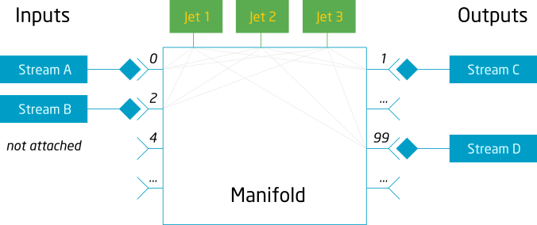

# Multiple Input and Output Streams

ModelOp Center Engines now support multiple input and output streams through stream slots. 

The Engine has multiple slots to attached streams where the even slot numbers
starting at 0 are for inputs and the odd slot numbers starting with 1 are for
outputs.



This is particularly useful when the output of the models provides data for
multiple purposes or the model requires data from multiple data sources to run.
An example might be that a model produces a score that will be consumed by a
down stream application and also generates additional data that describes the
logic that was used to produce the score for auditing purposes. The auditing
data may or may not need to go to the downstream application but may also need
to be stored in a database. In this case you would have two output streams, one
for the downstream application and one for the database to store auditing data.

You can freely attach and detach streams to an engine while it is not running.
While the engine is running you can only replace streams, not detach them
completely. See [ModelOp Center Command Line Interface](../../Reference/ModelOp%20Center%20CLI/).

for information on controlling streams with the engine.

This capability allows you to create complex analytic workflows with multiple
engines, inputs, and outputs.

## The action() function name is configurable

The model must contain an action function so that the engine understands what
needs to be executed in the model. This function is configurable to allow for
multiple streams.

By default, data from all input streams are dispatched to the function named
'action'. Now the name of the function can be configured per slot. The following
annotations ask the engine to pass data from three input streams to three
different functions:

``` python
# fastscore.action.0: calculate_score
# fastscore.action.2: process_report
# fastscore.action.4: do_action
```

## The action() function may receive a slot number and sequence number

The model runner automatically detects the arity of the action() function and
(in addition to data) may pass the slot number and a sequence number to the
function. For example:

``` python
def action(data)                # data only
def action(data, slot)          # data and slot number
def action(data, slot, seq_no)  # data, slot number, and sequence number
```

New-style model annotations define a set of input/output streams the model
expects. The following model uses three input (0, 2, and 4) and two output slots
(1 and 3):

``` python
# fastscore.schema.0: schema-1
# fastscore.recordsets.2: true
# fastscore.action.4: action
# fastscore.schema.1: schema-2
# fastscore.slot.3: in-use
```
See [Model Annotations](https://opendatagroup.github.io/Product%20Manuals/Model%20Annotations/) for more information about the
new-style model annotations.

