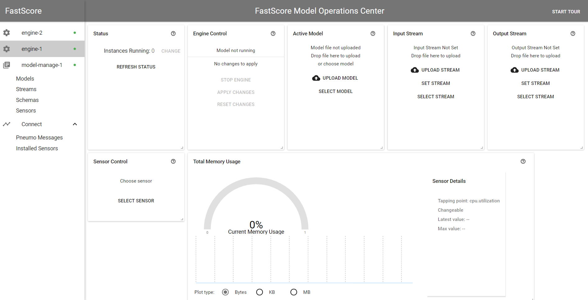
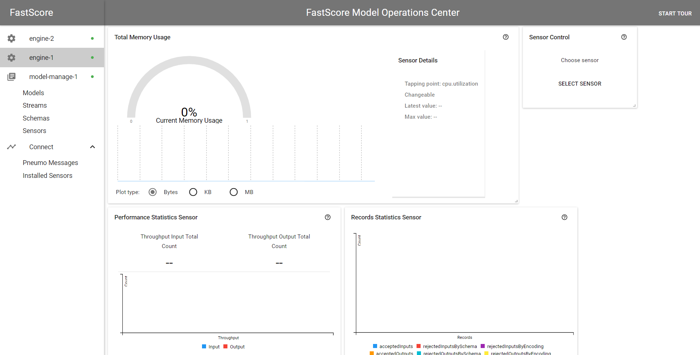

# Sensors

## Overview

A sensor is a configurable function that:

* Can be turned on and off (installed/uninstalled)
* Is associated with a particular spot on the code path (a tapping point)
* Activates according to a schedule
* Can filter/aggregate measurements
* Publishes results separately from the output stream
* Has a language-agnostic descriptor
* May output cost-related information

Examples of potential uses for sensors include record/byte counters at the edge of an input stream, CPU utilization measurements for the main process, or a memory usage gauge for model runners. Some sensors are added to a ModelOp Center microservice by default, e.g., the memory usage monitor present in Dashboard. 

## Sensor Descriptors

A sensor descriptor is conceptually similar to a stream descriptor: it has a name, and is stored in Model Manage. A template for a sensor descriptor is:
``` json
{
  "Tap": "sys.memory",
  "Activate": {
    "Type": "regular",
    "Interval": 0.5
  },
  "Report": {
    "Interval": 3.0
  },
  "Filter": {
    "Type":">=",
    "Threshold":1G
  }
}
```

This particular sensor reports system memory usage, but only if it exceeds 1 gigabyte.

| Field | Explanation | Type |
| --- | --- | --- |
| `Tap` | The tapping point for the sensor. Currently, this can be either `"sys.memory"`, or `"sys.cpu.utilization"`. | `string` |
| `Activate` | A field to describe when to collect sensor readings. In the example, the sensor activates every 0.5 seconds. | `object` |
| `Activate.Type` | Allowed values: `"permanent"`, `"regular"`, `"random"`. | `string` |
| `Activate.Intensity` | The number of activation events per second. (The `Interval` element must be omitted.) | `float` |
| `Activate.Interval` | The time between activation events. (The `Intensity` element must be omitted.) | `float` |
| `Activate.Duration` | The time to keep the tapping point active. | `float` |
| `Activate.MaxReads` | Deactivate after receiving this many reads. | `int` |
| `Report` | A field to describe when to report sensor readings. In the example, the sensor reports every 3 seconds. | `object` |
| `Report.Interval` | How often to report sensor readings. | `float` |
| `Filter` | The filtering function of the sensor. Defaults to null. | `object` |
| `Filter.Type` | Allowed values: `">"`, `">="`, `"<"`, "`<=`", `"within-range"`, `"outside-range"` | `string` |
| `Filter.Threshold` | The threshold value for less-than or greater-than comparisons. | `float` |
| `Filter.MinValue` | The minimum value for range filters. | `float` |
| `Filter.MaxValue` | The maximum value for range filters. | `float` |
| `Aggregate` | The aggregation function of the sensor. Accepts `"accumulate"`, `"sum"`, and `"count"` as shortcuts. Defaults to `"accumulate"`. | `object` |
| `Aggregate.Type` | One of `"accumulate"`, `"sum"`, or `"count"`. | `string` |
| `Aggregate.SampleSize` | The maximum number of values to accumulate. | `int` |


Note that the filter values `Threshold`, `MinValue`, and `MaxValue` accept human-friendly values, e.g., "1G" instead of 1073741824. 

## An Example

Let's add the sensor example above to ModelOp Center. We can do this using the CLI:
```
fastscore sensor add s1 <<EOF
{
  "Tap": "sys.memory",
  "Activate": {
    "Type": "regular",
    "Interval": 0.5
  },
  "Report": {
    "Interval": 3.0
  }
}
EOF
```

After entering this command, the CLI will return `Sensor 's1' added` if the command was successful. 

Currently, all sensors have to be installed on Model Manage. Install the sensor:

```
$ fastscore tap install model-manage-1 s1
Sensor 's1' installed [2]
```

The number in the square brackets is the identifier of the sensor deployment. The identifier will be needed to stop the sensor later. It can also be found from the `fastscore tap list` command:

```
$ fastscore tap list model-manage-1
  Id  Tap         Active
----  ----------  --------
   2  sys.memory  No
```

The sensor activates periodically (2 times a second), and collects the memory consumed by the service. The collected data is reported as Pneumo messages (Kafka messages on the topic "notify") every 3 seconds. These can be viewed in the CLI with the `ModelOp Center pneumo` command:

```
$ fastscore pneumo
[model-manage-1] 16:10:44 sys.memory [2] [2123345920, 2123345920, 2123345920, 2123345920, 2123345920, 2123345920]
[model-manage-1] 16:10:47 sys.memory [2] [2123345920, 2123345920, 2123345920, 2123345920, 2123345920, 2123345920]
[model-manage-1] 16:10:50 sys.memory [2] [2123345920, 2123345920, 2123345920, 2123345920, 2123345920, 2123345920]
```

The sensor can be uninstalled using the `fastscore tap uninstall` command:

```
$ fastscore tap uninstall model-manage-1 2
Sensor [2] uninstalled
```

Once uninstalled, these reports will no longer be send through Pneumo.

## Default Sensors

Eight sensors are installed in each engine by default:
```
  Id  Tap
----  ---------------------------------------
   1  manifold.1.records.size
   2  manifold.0.records.size
   3  manifold.1.records.rejected.by.encoding
   4  manifold.0.records.rejected.by.encoding
   5  manifold.1.records.count
   6  manifold.0.records.count
   7  manifold.1.records.rejected.by.schema
   8  manifold.0.records.rejected.by.schema
```


*This graph shows the Memory usage metrics that the sensor is capturing.*


*These graphs show the throughput and count of records with that are rejected due to some specific issue and records that are accepted.*